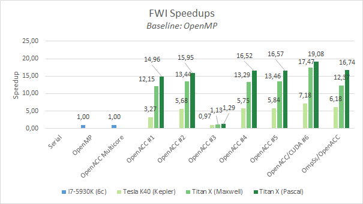

# GTC2017 Lab Instructions

In this lab you will make modifications to a real world mini application, then compile and execute the newly enhanced code in each step. Along the way, solutions are provided, so you can check your work, or take a peek if you get lost.

After login into the machine you should see 7 folders. `FWI` is the folder were this lab will take place and the other `FWI-sol-step` folders contain the solution for each step. Each one of those folders is just a checkout of the same FWI repository at a different branch. In case you want to discover all possible branches just type `git branch -a` inside one of those folders.

```bash
~# ls -l
total 28
drwxr-xr-x 10 root root 4096 Apr 27 11:26 FWI
drwxr-xr-x 10 root root 4096 Apr 27 11:26 FWI-sol-step1
drwxr-xr-x 10 root root 4096 Apr 27 11:27 FWI-sol-step2
drwxr-xr-x 10 root root 4096 Apr 27 11:27 FWI-sol-step3
drwxr-xr-x 10 root root 4096 Apr 27 11:27 FWI-sol-step4
drwxr-xr-x 10 root root 4096 Apr 27 11:27 FWI-sol-step5
drwxr-xr-x 10 root root 4096 Apr 27 11:27 FWI-sol-step6
drwxr-xr-x 10 root root 4096 Apr 27 11:27 FWI-sol-ompss-acc
```

Now enter the `FWI` folder:

```bash
$ cd FWI
```

Initially the `FWI` folder will be in `gtc2017` branch. If for some reason, during the labs, you want to check the difference between the solutions and your implementation you just have to execute: `git diff gtc2017-sol-step?` and you will see the differences between your current branch and the selected one. Or if you want to skip to the solution feel free to checkout the next branch.

> Machine used to display execution times & speedups: Intel i7-5930k (6-core with HT) + 1x Titan X (Pascal)

## Step 0: Characterize FWI application

The initial step of every paralelization effort is to check whether it makes sense to apply optimizations or not. In the case of accelerator programming a certain number of questions have to be answered before the first line of code is written. This includes:
* Understanding the program structure and how data is passed through the call tree
* Profiling the CPU-only version of the application and identifying computationally-intense "hot spots"
* Identify which loop nests dominate the runtime
* Are the loop nests suitable for an accelerator?
* Insuring that the algorithms you are considering for acceleration are safely parallel

> Although in the Step 0 of this lab you only have to profile & execute the sequential implementation and execute the OpenMP version, it can indeed take some time to execute. Feel free to just **read** the Step 0 and skip to Step 1 whenever you feel ready.

Firstly we will compile & execute the sequential version of FWI to annotate the initial performance:
```
$ mkdir build
$ cd build
$ cmake -DCMAKE_C_COMPILER=gcc ..
$ make
```
Then you execute FWI either using `make irun` or `bin/fwi ../data/fwi_params.txt ../data/fwi_frequencies.profile.txt`. You should see something like this:
```
$ make irun
[ 62%] Built target fwi-core
[ 87%] Built target fwi
[100%] outputs will be in /root/FWI/scripts/output/
PROJECT_SOURCE_DIR: /root/FWI
PROJECT_BINARY_DIR: /root/FWI/build/bin
COMPILER_ID:        GNU
---
/root/FWI/build/bin/fwi /root/FWI/data/fwi_params.txt /root/FWI/data/fwi_frequencies.profile.txt
---
Freq: 2.0 ------------------------
Processing 0-th gradient iteration.
        Gradient loop processed for the 0-th shot
FWI Program finished in 266.472365 seconds
[100%] Built target irun
```

Then we are going to profile FWI to search for hot spots using `nvprof --cpu-profiling on` (you can use `make iprofile` or call `nvprof` directly from console: `nvprof --cpu-profiling on bin/fwi ../data/fwi_params.txt ../data/fwi_frequencies.profile.txt`). Like the following example:

```bash
$ cmake -DCMAKE_C_COMPILER=gcc -DPROFILE=ON ..
$ make
$ nvprof --cpu-profiling on bin/fwi ../data/fwi_params.txt ../data/fwi_frequencies.profile.txt
Freq: 2.0 ------------------------
Processing 0-th gradient iteration.
        Gradient loop processed for the 0-th shot
FWI Program finished in 269.667140 seconds

======== CPU profiling result (bottom up):
Time(%)      Time  Name
 23.19%  62.5323s  velocity_propagator
 21.47%  57.9022s  compute_component_scell_BL
 21.34%  57.5522s  compute_component_scell_TR
 20.35%  54.8721s  compute_component_scell_BR
 11.13%  30.0111s  compute_component_scell_TL
  2.37%  6.38024s  compute_component_vcell_BR
  0.06%  150.01ms  __c_mzero4
  0.06%  150.01ms  | ???
  0.06%  150.01ms  __c_mset4
  0.03%  90.003ms  | ???
  0.02%  50.002ms  _IO_file_close
  0.02%  50.002ms  | _IO_file_close_it
  0.02%  50.002ms  |   _IO_fclose
  0.02%  50.002ms  |     safe_fclose
  0.01%  30.001ms  open
  0.01%  30.001ms  | _IO_file_open
  0.01%  30.001ms  |   _IO_file_fopen
  0.01%  30.001ms  |     ???
  0.01%  30.001ms  |       safe_fopen
  0.01%  30.001ms  munmap
  0.01%  30.001ms    __free

======== Data collected at 100Hz frequency
```
We can clearly see that the 99,85% of the execution time is split between *scell* functions (74,20%) and *vcell* functions (25,56%). If we take a look at those functions in **src/fwi_propagator.c** we will arrive to this conclusions:
1. They are embarrassingly parallel
2. We only have to think about how to parallelize one of the *scell* and *vcell* functions and then apply the same strategy to the rest.

Now we will recompile enabling OpenMP and execute the application to measure the performance of OpenMP vs the serial implementation:
```bash
$ cmake -DCMAKE_C_COMPILER=gcc -DUSE_OPENMP=ON ..
$ make irun
[ 62%] Built target fwi-core
[ 87%] Built target fwi
[100%] outputs will be in /root/FWI/scripts/output/
PROJECT_SOURCE_DIR: /root/FWI
PROJECT_BINARY_DIR: /root/FWI/build/bin
COMPILER_ID:        GNU
---
/root/FWI/build/bin/fwi /root/FWI/data/fwi_params.txt /root/FWI/data/fwi_frequencies.profile.txt
---
Freq: 2.0 ------------------------
Processing 0-th gradient iteration.
        Gradient loop processed for the 0-th shot
FWI Program finished in 52.054321 seconds
```

We got 5.12x compared the sequential version.

## Step 1: Adding OpenACC directives

In this step, you will add compute regions around your expensive parallel loop(s). We assume you already have some OpenACC knowledge.

In this lab we have used the **kernels** directive extensively but the **loop** directive could also been used.

Then, we will proceed to add `#pragma acc kernels` directives to all compute-intensive parts of our code. As we have seen in Step 0 those functions are (file `src/fwi_propagator.c`):
   - vcell_TL
   - vcell_TR
   - vcell_BL
   - vcell_BR
   - scell_TL
   - scell_TR
   - scell_BL
   - scell_BR

For instance with *vcell_TR* the code will look like this:
```c
#pragma acc kernels
for(integer y=ny0; y < nyf; y++)
{
    for(integer x=nx0; x < nxf; x++)
    {
        for(integer z=nz0; z < nzf; z++)
        {
            const real lrho = rho_TR(rho, z, x, y, dimmz, dimmx);

            const real stx  = stencil_X( _SX, sxptr, dxi, z, x, y, dimmz, dimmx);
            const real sty  = stencil_Y( _SY, syptr, dyi, z, x, y, dimmz, dimmx);
            const real stz  = stencil_Z( _SZ, szptr, dzi, z, x, y, dimmz, dimmx);

            vptr[IDX(z,x,y,dimmz,dimmx)] += (stx  + sty  + stz) * dt * lrho;
        }
    }
}
```

In the first implementation we are going to use CUDA Unified Memory (also called 'CUDA Managed Memory'). You have to modify the `pgcc` flags in **CMakeLists.txt** file and add the `managed` to the `-ta=tesla` target. It should look like this:
```cmake
set(OpenACC_C_FLAGS "${OpenACC_C_FLAGS} -ta=tesla,cuda8.0,cc20,cc35,cc50,cc60,lineinfo,managed")
```

After that we can try to compile the application (*notice that we changed* from **gcc** to **pgcc** ! and also we enabled OpenACC with **-DUSE_OPENACC=ON** !):
```bash
$ mkdir build
$ cd build
$ cmake -DCMAKE_C_COMPILER=pgcc -DUSE_OPENMP=OFF -DUSE_OPENACC=ON ..
$ make
[ 44%] Building C object src/CMakeFiles/fwi-core.dir/fwi_propagator.c.o
compute_component_vcell_TR:
    211, Generating implicit copy(vptr[:])
    212, Loop carried dependence due to exposed use of vptr[:*] prevents parallelization
         Accelerator kernel generated
        212, #pragma acc loop seq
        214, #pragma acc loop seq
        216, #pragma acc loop seq
    212, Accelerator scalar kernel generated
    214, Loop carried dependence due to exposed use of vptr[:*] prevents parallelization
         216, Loop carried dependence due to exposed use of vptr[:*] prevents parallelization
              Complex loop carried dependence of vptr-> prevents parallelization
```
But oops! the compiler detects a dependence and prevents a parallelization (it generates a scalar kernel!). Since we know that *vcell_TR* is embarrasingly parallel and there isn't a dependence we will put a `#pragma acc loop independent` before each iteration level to force the compiler to parallelize the region. Example:

```c
#pragma acc kernels
#pragma acc loop independent
for (integer y=ny0; y < nyf; y++) {
    #pragma acc loop independent
    for (integer x=nx0; x < nxf; x++) {
        #pragma acc loop independent
        for (integer z=nz0; z < nzf; z++) {
```
Then we can compile again:
```bash
$ make
Scanning dependencies of target fwi-core
[ 11%] Building C object src/CMakeFiles/fwi-core.dir/fwi_propagator.c.o
compute_component_vcell_TR:
    211, Generating implicit copy(vptr[:])
    213, Loop is parallelizable
         Generating Multicore code
        213, #pragma acc loop gang
    216, Loop is parallelizable
         219, Loop is parallelizable
              Accelerator kernel generated
              Generating Tesla code
             213, #pragma acc loop gang /* blockIdx.y */
             216, #pragma acc loop gang, vector(4) /* blockIdx.z threadIdx.y */
             219, #pragma acc loop gang, vector(32) /* blockIdx.x threadIdx.x */
[ 22%] Linking C static library ../lib/libfwi-core.a
[ 55%] Built target fwi-core
[ 66%] Linking C executable ../../bin/fwi-data-generator
[ 77%] Built target fwi-data-generator
[ 88%] Linking C executable ../bin/fwi
[100%] Built target fwi
```
Functions called inside OpenACC parallel regions must be either inlined or declared with the `#pragma acc routine <type>` specifier. Since we are compiling with `-O3`, `pgcc` decided to inline *rho_TR*, *stencil_X*, *stencil_Y* & *stencil_Z*. But what happens if we compile with `-O0` ?

```
$ cmake -DCMAKE_C_COMPILER=pgcc -DCMAKE_BUILD_TYPE=Debug -DUSE_OPENMP=OFF -DUSE_OPENACC=ON ..
$ make
compute_component_vcell_TR:
    211, Accelerator region ignored
    221, Accelerator restriction: call to 'rho_TR' with no acc routine information
```

So you will have to add the `#pragma acc routine seq` directive to every function (`include/fwi/fwi_propagator.h` file) that is called inside a OpenACC kernels region. This way the compiler will know it is a device-callable function (`-O0`) or it will just inline the whole function (`-O3`).

For instance, with `rho_TR`, in file `include/fwi/fwi_propagator.h`:
```c
#pragma acc routine seq
real rho_TR ( const real* restrict rho,
              const integer z,
              const integer x,
              const integer y,
              const integer dimmz,
              const integer dimmx);
```
The list of functions declarations to be modified is:
 * IDX
 * stencil_X
 * stencil_Y
 * stencil_Z
 * rho_TR
 * rho_TL
 * rho_BR
 * rho_BL
 * stress_update
 * cell_coeff_BR
 * cell_coeff_TL
 * cell_coeff_BL
 * cell_coeff_TR
 * cell_coeff_ARTM_BR
 * cell_coeff_ARTM_TL
 * cell_coeff_ARTM_BL
 * cell_coeff_ARTM_TR

Now proceed with the rest of the vcell & scell functions*, remember that the strategy is the same as the example shown here.


As an extra, you should move the data initialization to the gpu by puting a `#pragma acc kernels` before the loop in function `set_array_to_constant` (file `src/fwi_kernels.c`). Example:

```c
void set_array_to_constant(...)
{
    #pragma acc kernels
    for ( integer i = 0; i < length; i++ )
        array[i] = value
}
```

Finally, to prevent incorrect executions, we should put a stream synchronization (`#pragma acc wait`) before the end of the current iteration in the time propagation loop (`propagate_shot` function of `src/fwi_kernel.c` file), just after the MPI exchange boundaries and before time compuations.

#### Benchmarking

After implementing all *scell* and *vcell* functions we can proceed to measure the execution time:
```
$ make irun
Scanning dependencies of target irun
[100%] outputs will be in /root/FWI-sol-step1/scripts/output/
PROJECT_SOURCE_DIR: /root/FWI-sol-step1
PROJECT_BINARY_DIR: /root/FWI-sol-step1/build/bin
COMPILER_ID:        PGI
---
/root/FWI-sol-step1/build/bin/fwi /root/FWI-sol-step1/data/fwi_params.txt /root/FWI-sol-step1/data/fwi_frequencies.profile.txt
---
MPI rank 0 with GPU 0 (4)
Freq: 2.0 ------------------------
Processing 0-th gradient iteration.
        Gradient loop processed for the 0-th shot
FWI Program finished in 3.480487 seconds
[100%] Built target irun
```
That is, 14.96x faster than the original OpenMP version.

## Step 2: Profile & Optimize the applicaiton

In Step 2 we have to profile the application to find possible weaknesses and optimization opportunities. We could use *Nvidia Visual Profiler* for a graphical assestment of the application or `pgprof`/`nvprof` for a command-line visualization. For simplicity in this lab we are going to use `nvprof`:
```bash
$ nvprof bin/fwi ../data/fwi_params.txt ../data/fwi_frequencies.profile.txt
==2015== NVPROF is profiling process 2015, command: bin/fwi ../data/fwi_params.txt ../data/fwi_frequencies.profile.txt
MPI rank 0 with GPU 0 (4)
Freq: 2.0 ------------------------
Processing 0-th gradient iteration.
        Gradient loop processed for the 0-th shot
FWI Program finished in 3.608973 seconds
==2015== Profiling application: bin/fwi ../data/fwi_params.txt ../data/fwi_frequencies.profile.txt
==2015== Profiling result:
Time(%)      Time     Calls       Avg       Min       Max  Name
 21.24%  630.88ms       300  2.1029ms  179.75us  6.0901ms  compute_component_scell_TR_648_gpu
 21.18%  629.15ms       300  2.0972ms  163.27us  6.0794ms  compute_component_scell_BR_901_gpu
 20.05%  595.66ms       300  1.9855ms  170.41us  5.7658ms  compute_component_scell_BL_1028_gpu
 13.11%  389.54ms       300  1.2985ms  113.93us  3.7244ms  compute_component_scell_TL_774_gpu
  8.65%  256.91ms        58  4.4295ms  3.4027ms  7.6222ms  set_array_to_constant_52_gpu
  4.34%  128.80ms       900  143.11us  14.881us  406.93us  compute_component_vcell_BR_291_gpu
  3.82%  113.39ms       900  125.99us  12.320us  356.43us  compute_component_vcell_TL_183_gpu
  3.81%  113.27ms       900  125.86us  12.737us  362.80us  compute_component_vcell_BL_345_gpu
  3.80%  112.95ms       900  125.50us  12.960us  357.74us  compute_component_vcell_TR_237_gpu

==2015== Unified Memory profiling result:
Device "TITAN X (Pascal) (0)"
   Count  Avg Size  Min Size  Max Size  Total Size  Total Time  Name
    3810         -         -         -           -  123.7249ms  GPU Page fault groups
Total CPU Page faults: 1
...
```
We can see that *scell* kernels take more time than *vcell* kernels.

Now we will obtain the occupancy for again with `nvprof`:
```bash
$ nvprof --metrics achieved_occupancy bin/fwi ../data/fwi_params.txt ../data/fwi_frequencies.profile.txt
==2042== NVPROF is profiling process 2042, command: bin/fwi ../data/fwi_params.txt ../data/fwi_frequencies.profile.txt
MPI rank 0 with GPU 0 (4)
Freq: 2.0 ------------------------
Processing 0-th gradient iteration.
        Gradient loop processed for the 0-th shot
FWI Program finished in 74.528802 seconds
==2042== Profiling application: bin/fwi ../data/fwi_params.txt ../data/fwi_frequencies.profile.txt
==2042== Profiling result:
==2042== Metric result:
Invocations                               Metric Name                        Metric Description         Min         Max         Avg
Device "TITAN X (Pascal) (0)"
    Kernel: compute_component_vcell_TR_237_gpu
        900                        achieved_occupancy                        Achieved Occupancy    0.373496    0.395784    0.384743
    Kernel: compute_component_vcell_BR_291_gpu
        900                        achieved_occupancy                        Achieved Occupancy    0.328186    0.339323    0.334482
    Kernel: compute_component_scell_TR_648_gpu
        300                        achieved_occupancy                        Achieved Occupancy    0.181673    0.184740    0.184103
    Kernel: compute_component_vcell_TL_183_gpu
        900                        achieved_occupancy                        Achieved Occupancy    0.372697    0.395206    0.384698
    Kernel: set_array_to_constant_52_gpu
         58                        achieved_occupancy                        Achieved Occupancy    0.924032    0.955698    0.939211
    Kernel: compute_component_scell_BR_901_gpu
        300                        achieved_occupancy                        Achieved Occupancy    0.181021    0.184291    0.183419
    Kernel: compute_component_scell_TL_774_gpu
        300                        achieved_occupancy                        Achieved Occupancy    0.180216    0.182999    0.182345
    Kernel: compute_component_scell_BL_1028_gpu
        300                        achieved_occupancy                        Achieved Occupancy    0.180706    0.184159    0.183399
    Kernel: compute_component_vcell_BL_345_gpu
        900                        achieved_occupancy                        Achieved Occupancy    0.372508    0.394239    0.384888
```
Unfortunately the achieved occupancy of *scell* kernels is too low. We are going to focus in increasing that occupancy. One way to do this is limiting the number of registers per thread block to achieve more occupancy in exchange of more memory pressure (register spills).

Add `maxregcount:128` to`-ta=tesla` target  (`CMakeLists.txt` file).

#### Benchmarking

Now we can execute FWI and compare with the previous step

```bash
# make irun
[ 62%] Built target fwi-core
[ 87%] Built target fwi
[100%] outputs will be in /root/FWI-sol-step2/scripts/output/
PROJECT_SOURCE_DIR: /root/FWI-sol-step2
PROJECT_BINARY_DIR: /root/FWI-sol-step2/build/bin
COMPILER_ID:        PGI
---
/root/FWI-sol-step2/build/bin/fwi /root/FWI-sol-step2/data/fwi_params.txt /root/FWI-sol-step2/data/fwi_frequencies.profile.txt
---
MPI rank 0 with GPU 0 (4)
Freq: 2.0 ------------------------
Processing 0-th gradient iteration.
        Gradient loop processed for the 0-th shot
FWI Program finished in 3.262811 seconds
[100%] Built target irun
```
We improved a little bit from 14.96x to 15,95x.

## Step 3: Moving from Unified Memory to OpenACC Data clauses

Unified Memory can be very inneficient in older GPU generations and an experienced programmer with detailed knowledge of the application algorithm can outperform the Unified Memory.

Therefore in this step we are going to focus on migrating from the CUDA Unified Memory to a more manual movement of data using OpenACC directives.

Firstly we have to remove the `managed` flag from `CMakeLists.txt`. Also, in every parallel region we have to specify all data dependences with `copyin`, `copyout` or `copy` clauses.

In `set_array_to_constant` we have to add:
```c
#pragma acc kernels copy(array[0:length])
```

Similarly in *vcell* kernels we should add:
```c
const integer start  = ((nzf-nz0) + 2*HALO) * ((nxf-nx0) + 2*HALO) * (ny0 - HALO);
const integer end    = ((nzf-nz0) + 2*HALO) * ((nxf-nx0) + 2*HALO) * (nyf + HALO);
const integer nelems = end - start;

#pragma acc kernels copyin(szptr[start:nelems], sxptr[start:nelems], syptr[start:nelems], rho[start:nelems]) \
                    copy(vptr[start:nelems])
```

And in *scell* kernels:
```c
const integer start  = ((nzf-nz0) + 2*HALO) * ((nxf-nx0) + 2*HALO) * (ny0 - HALO);
const integer end    = ((nzf-nz0) + 2*HALO) * ((nxf-nx0) + 2*HALO) * (nyf + HALO);
const integer nelems = end - start;

#pragma acc kernels copy(sxxptr[start:nelems], syyptr[start:nelems], szzptr[start:nelems], syzptr[start:nelems], sxzptr[start:nelems], sxyptr[start:nelems]) \
                    copyin(vxu[start:nelems], vxv[start:nelems], vxw[start:nelems])  \
                    copyin(vyu[start:nelems], vyv[start:nelems], vyw[start:nelems])  \
                    copyin(vzu[start:nelems], vzv[start:nelems], vzw[start:nelems])  \
                    copyin(cc11[start:nelems], cc12[start:nelems], cc13[start:nelems], cc14[start:nelems], cc15[start:nelems], cc16[start:nelems]) \
                    copyin(cc22[start:nelems], cc23[start:nelems], cc24[start:nelems], cc25[start:nelems], cc26[start:nelems]) \
                    copyin(cc33[start:nelems], cc34[start:nelems], cc35[start:nelems], cc36[start:nelems]) \
                    copyin(cc44[start:nelems], cc45[start:nelems], cc46[start:nelems]) \
                    copyin(cc55[start:nelems], cc56[start:nelems]) \
                    copyin(cc66[start:nelems])
```

#### Benchmarking

Now we can run the application again:
```bash
# make irun
[ 62%] Built target fwi-core
[ 87%] Built target fwi
Scanning dependencies of target irun
[100%] outputs will be in /root/FWI-sol-step3/scripts/output/
PROJECT_SOURCE_DIR: /root/FWI-sol-step3
PROJECT_BINARY_DIR: /root/FWI-sol-step3/build/bin
COMPILER_ID:        PGI
---
/root/FWI-sol-step3/build/bin/fwi /root/FWI-sol-step3/data/fwi_params.txt /root/FWI-sol-step3/data/fwi_frequencies.profile.txt
---
MPI rank 0 with GPU 0 (4)
Freq: 2.0 ------------------------
Processing 0-th gradient iteration.
        Gradient loop processed for the 0-th shot
FWI Program finished in 40.483071 seconds
[100%] Built target irun
```
Since we got an slowdown we should profile the application again to get an insight of what is happening:

```
# nvprof bin/fwi ../data/fwi_params.txt ../data/fwi_frequencies.profile.txt
==10572== NVPROF is profiling process 10572, command: bin/fwi ../data/fwi_params.txt ../data/fwi_frequencies.profile.txt
MPI rank 0 with GPU 0 (4)
Freq: 2.0 ------------------------
Processing 0-th gradient iteration.
        Gradient loop processed for the 0-th shot
FWI Program finished in 43.766681 seconds
==10572== Profiling application: bin/fwi ../data/fwi_params.txt ../data/fwi_frequencies.profile.txt
==10572== Profiling result:
Time(%)      Time     Calls       Avg       Min       Max  Name
 78.21%  24.8734s     61258  406.04us  85.955us  1.0648ms  [CUDA memcpy HtoD]
 12.99%  4.13221s     10800  382.61us  80.516us  1.0165ms  [CUDA memcpy DtoH]
  2.07%  658.96ms       300  2.1965ms  190.79us  6.3724ms  compute_component_scell_TR_681_gpu
  2.07%  657.51ms       300  2.1917ms  178.76us  6.6763ms  compute_component_scell_BR_960_gpu
  1.93%  612.74ms       300  2.0425ms  183.02us  6.2133ms  compute_component_scell_BL_1100_gpu
  1.26%  400.02ms       300  1.3334ms  116.39us  3.8245ms  compute_component_scell_TL_820_gpu
  0.41%  129.30ms       900  143.67us  12.736us  441.72us  compute_component_vcell_BR_306_gpu
  0.36%  113.23ms       900  125.81us  10.817us  377.71us  compute_component_vcell_TR_247_gpu
  0.35%  112.77ms       900  125.30us  11.105us  382.90us  compute_component_vcell_TL_188_gpu
  0.35%  112.22ms       900  124.69us  10.688us  379.60us  compute_component_vcell_BL_365_gpu
  0.01%  2.6016ms        58  44.855us  44.737us  45.442us  set_array_to_constant_52_gpu
```
And unfortunately we see that H2D & D2H copies take 91.2% of the GPU execution time. In following steps we will optimize this behaviour.

## Step 4: Optimize data locality

In this step we are going to use OpenACC Data regions to increase the locality of data in the GPU. OpenACC offers two
sets of directives to to that task:
* `#pragma acc data` clause can be used to delcare a `scope` where the data resides in the GPU.
* `#pragma enter data` / `#pragma exit data` clauses can be used when de declaration and destruction of data resides in different scopes.

In our case, given that all allocations and deallocations happens in different scopes we are going to use `#pragma acc enter data create` and `#pragma acc exit data delete` to increase the locality in the GPU.

In `alloc_memory_shot` function (`src/fwi_kernel.c`), *after* allocations (`malloc`), add:

```c
const integer datalen = numberOfCells;

coeff_t cc = *c;
#pragma acc enter data create(cc)
#pragma acc enter data create(cc.c11[:datalen])
#pragma acc enter data create(cc.c12[:datalen])
... // allocate c11,c12,c13,c14,c15,c16, c22,c23,c24,c25,c26, c33,c34,c35,c36, c44,c45,c46, c55,c56, c66

v_t vv = *v;
#pragma acc enter data copyin(vv)
#pragma acc enter data create(vv.tl.u[:datalen])
#pragma acc enter data create(vv.tl.v[:datalen])
... // allocate all <tl|tr|bl|br>.<u|v|w> combinations

s_t ss = *s;
#pragma acc enter data copyin(ss)
#pragma acc enter data create(ss.tl.zz(:datalen])
#pragma acc enter data create(ss.tl.xz(:datalen])
... // allocate all <tl|tr|bl|br>.<zz|xz|yz|xx|xy|yy> combinations

const real* rrho = *rho;
#pragma acc enter data create(rrho[:datalen])
```

In `free_memory_shot` function, *before* all dealocations (`free`) we should first, deallocate the GPU memory with:

```c
#pragma acc wait

#pragma acc exit data delete(c->c11)
#pragma acc exit data delete(c->c12)
...
#pragma acc exit data delete(c)
...

#pragma acc exit data delete(v->tl.u)
#pragma acc exit data delete(v->tl.v)
...
#pragma acc exit data delete(v)

#pragma acc exit data delete(s->tl.zz)
#pragma acc exit data delete(s->tl.xz)
...
#pragma acc exit data delete(s)

const real* rrho = *rho;
#pragma acc exit data delete(rrho)
```

#### Benchmarking

Now we can run the application again:

```
# make irun
[ 62%] Built target fwi-core
[ 87%] Built target fwi
[100%] outputs will be in /root/FWI-sol-step4/scripts/output/
PROJECT_SOURCE_DIR: /root/FWI-sol-step4
PROJECT_BINARY_DIR: /root/FWI-sol-step4/build/bin
COMPILER_ID:        PGI
---
/root/FWI-sol-step4/build/bin/fwi /root/FWI-sol-step4/data/fwi_params.txt /root/FWI-sol-step4/data/fwi_frequencies.profile.txt
---
MPI rank 0 with GPU 0 (4)
Freq: 2.0 ------------------------
Processing 0-th gradient iteration.
        Gradient loop processed for the 0-th shot
FWI Program finished in 3.150908 seconds
[100%] Built target irun
```
And finally solved the problems we had in step 3, achieving 16.52x compared to OpenMP.

## Step 5: Asynchronous execution

OpenACC follows the same semantics as CUDA regarding streams. By default, kernels and memory copies are executed in the default stream which imposes seralization between kerenls and memory transfers.

This step will focus on using multiple streams to perform H2D,D2H copies concurrently with Kernel executions.
Also another important aspect of this step is that allows us to optimize HALO copies between multiple-GPUs when MPI is enabled. This is achieved by calculating first the HALO regions and then, while we exchange the HALO regions with MPI, execute the rest of the volume.

To differenciate the different parts of the application we are going to use the `phase_t` enum present in `include/fwi/fwi_propagator.h::78`:
```c
typedef enum {ONE_R, ONE_L, TWO, H2D, D2H} phase_t;
```

Then we can add the `async` clause to use multiple streams in *scell* and *vcell* functions and `#pragma acc wait(<stream list>)` to syncronize those streams.
As an example:
```c
#pragma acc kernels ... async(phase) wait(H2D)
```
  or
```c
#pragma acc wait(TWO, D2H)
```

#### Benchmarking

```bash
# make irun
[ 62%] Built target fwi-core
[ 87%] Built target fwi
[100%] outputs will be in /root/FWI-sol-step5/scripts/output/
PROJECT_SOURCE_DIR: /root/FWI-sol-step5
PROJECT_BINARY_DIR: /root/FWI-sol-step5/build/bin
COMPILER_ID:        PGI
---
/root/FWI-sol-step5/build/bin/fwi /root/FWI-sol-step5/data/fwi_params.txt /root/FWI-sol-step5/data/fwi_frequencies.profile.txt
---
MPI rank 0 with GPU 0 (4)
Freq: 2.0 ------------------------
Processing 0-th gradient iteration.
        Gradient loop processed for the 0-th shot
FWI Program finished in 3.140944 seconds
[100%] Built target irun
```
This time we obtained a slight improvement due we are only using 1 GPU. When using multi-GPU excecutjions with MPI the performance should increace.

## Step 6: Add glue code to call CUDA Kernels

If we are not satisfied with the OpenACC kernel performance or we want to use a functionality only present in CUDA we can interoperate with CUDA.

In CUDA it is essential maximize memory bandwidth to achieve maximum performance. In our case we could take advantage of shared memory and shuffle instructions to boost the performance.

Due time limitations we already provide those optimized kernels (file `src/fwi_propagator.cu`) and your job is to add the boilerplate code to use those kernels from OpenACC (in file `src/fwi_propagator.c`).

We also provide the necessary modifications in `CMakeLists.txt` for compiling with `nvcc` and linking with `pgcc`.

In summary. You will have to add `#pragma acc host_data use_device` directives to pass the *device pointers* allocated by OpenACC to our CUDA kernels and call `acc_get_cuda_stream` to forward the current stream to cuda in every **vcell**/**scell** function. The parameters of `compute_component_vcell_TL_cuda` are the same of the current function without the phase, and with the stream we retrieved from the OpenACC runtime. Example:
```c
{
#if !defined(USE_CUDA)
    <... previous OpenACC impl. ...>
#else
    void* stream = acc_get_cuda_stream(phase)

    #pragma acc host_data use_device(szptr, sxptr, syptr, rho, vptr)
    {
        compute_component_vcell_TL_cuda(..., stream);
    }
#endif
};
```

#### Benchmarking

Then recompile with USE_CUDA_KERNELS=ON and execute FWI:

```bash
$ cmake -DCMAKE_C_COMPILER=pgcc -DUSE_OPENMP=OFF -DUSE_OPENACC=ON -DUSE_CUDA_KERNELS=ON ..
$ make irun
[ 27%] Built target fwi-core-cuda
[ 72%] Built target fwi-core
[ 90%] Built target fwi
[100%] outputs will be in /root/FWI-sol-step6/scripts/output/
PROJECT_SOURCE_DIR: /root/FWI-sol-step6
PROJECT_BINARY_DIR: /root/FWI-sol-step6/build/bin
COMPILER_ID:        PGI
---
/root/FWI-sol-step6/build/bin/fwi /root/FWI-sol-step6/data/fwi_params.txt /root/FWI-sol-step6/data/fwi_frequencies.profile.txt
---
MPI rank 0 with GPU 0 (4)
Freq: 2.0 ------------------------
Processing 0-th gradient iteration.
        Gradient loop processed for the 0-th shot
FWI Program finished in 2.728260 seconds
[100%] Built target irun
```
This time we improved the overall speedup to 20.64x compared OpenMP or 97.67x sequential version.


## FWI OmpSs/OpenACC

We include a preliminar version of the new OmpSs/OpenACC interoperability.

The general idea is to use OmpSs to track the dependences between tasks and manage GPU memory & Streams while using OpenACC to generate GPU kernels without having to use CUDA.
As an example:
```bash
const integer size = dimmz * dimmx * dimmy;

#pragma omp target device(openacc) copy_deps
#pragma omp task in( [size]rho, [size]sxptr, [size]syptr, [size]szptr ) inout( [size]vptr ) label(vcell_TL)
#pragma acc kernels deviceptr(rho, sxptr, syptr, szptr, vptr)
#pragma acc loop independent
for(integer y=ny0; y < nyf; y++)
{
    #pragma acc loop independent
    for(integer x=nx0; x < nxf; x++)
    {
        #pragma acc loop independent
        for(integer z=nz0; z < nzf; z++)
        {
            const real lrho = RHO_BL( rho,z,x,y,dimmz,dimmx );

            const real stx = STENCILX( sxptr,SX,dxi,z,x,y,dimmz,dimmx );
            const real sty = STENCILY( syptr,SY,dyi,z,x,y,dimmz,dimmx );
            const real stz = STENCILZ( szptr,SZ,dzi,z,x,y,dimmz,dimmx );

            vptr[IDX(z,x,y,dimmz,dimmx)] += (stx  + sty  + stz) * dt * lrho;
        }
    }
}
```
We only support the `kernels` and `loop` directive with clauses `deviceptr`. Any other combination is not supported.
Also, we are restricted to only one GPU.

To build this example:
```bash
cd FWI-sol-ompss-acc
make -i
NX_ARGS="--gpus=1" ./fwi data/fwi_params.txt data/fwi_frequencies.profile.txt
```




