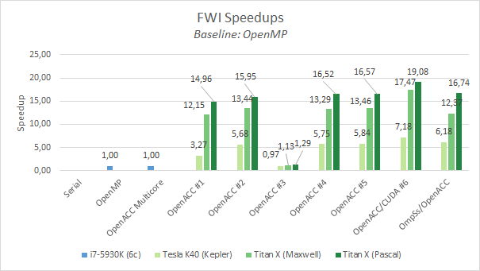

# GTC2017 Europe - Instructor-Led Lab: *Best GPU Code Practices Combining OpenACC, CUDA, and OmpSs*
## Lab Instructions

In this lab you will make modifications to a real world oil&gas mini application called `FWI`.  
You will compile and execute the newly enhanced code in each step. 
Along the way, solutions are provided, so you can check your work, or take a peek if you get lost.

After login into the machine you should see a folder called `FWI` containing each *step* and *solution* as a different branch:

```bash
~# git branch
* gtc2017eu-step1
  gtc2017eu-step1-sol
  gtc2017eu-step2
  gtc2017eu-step2-sol
  gtc2017eu-step3
  gtc2017eu-step3-sol
  gtc2017eu-step4
  gtc2017eu-step4-sol
  gtc2017eu-step5
  gtc2017eu-step5-sol
  gtc2017eu-step6
  gtc2017eu-step6-sol
```

Use `git diff <branch-name>` to compare branches and `git stash && git checkout <branch-name>` to discard non-commited changes and change to another step (branch).

> Machine used to display execution times & speedups: Intel i7-5930k (6-core with HT) + 1x Titan X (Maxwell)

> *Step 0: Characterize FWI application* can be found in Appendix 0

## Step 1: Adding OpenACC directives

In this step, you will add compute regions around expensive loops in the application. 
We assume you already have some OpenACC knowledge.

In this lab we have used the **kernels** directive extensively but the **loop** directive could also been used.

To reduce time, we will suppose we have profiled the mini-app and we got this results (see Appendix 0):

```bash
$ nvprof --cpu-profiling on bin/fwi ../data/fwi_params.txt ../data/fwi_frequencies.profile.txt
Freq: 2.0 ------------------------
Processing 0-th gradient iteration.
        Gradient loop processed for the 0-th shot
FWI Program finished in 269.667140 seconds

======== CPU profiling result (bottom up):
Time(%)      Time  Name
 23.19%  62.5323s  velocity_propagator
 21.47%  57.9022s  compute_component_scell_BL
 21.34%  57.5522s  compute_component_scell_TR
 20.35%  54.8721s  compute_component_scell_BR
 11.13%  30.0111s  compute_component_scell_TL
  2.37%  6.38024s  compute_component_vcell_BR
  0.06%  150.01ms  __c_mzero4
...

======== Data collected at 100Hz frequency
```
We can clearly see that the 99,85% of the execution time is split between *scell* functions (74,20%) and *vcell* functions (25,56%). 
If we take a look at those functions in **src/fwi_propagator.c** we will arrive to this conclusions:
1. They are embarrassingly parallel
2. We only have to think about how to parallelize one of the *scell* and *vcell* functions and then apply the same strategy to the rest.

Then, we will proceed to add `#pragma acc kernels` directives to those regions. 
To facilitate your work we already implemented the majority of `openacc` pragmas leaving `vcell_TL` and `scell_TR` for you to implement.

In this first implementation we are going to use CUDA Unified Memory. 
For that purpose we already modified **CMakeLists.txt** to add the `managed` to the `-ta=tesla` openacc target. It should look like this:
```cmake
set(OpenACC_C_FLAGS "${OpenACC_C_FLAGS} -ta=tesla,cuda8.0,cc20,cc35,cc50,cc60,lineinfo,managed")
```

In the first step you should add a simple `#pragma acc kernels` in the outer-most loop of `src/fwi_propagator.c:166` (`compute_component_vcell_TL`) and `src/fwi_propagator.c:634` (`compute_component_scell_TR`). Example in `vcell_TR`:
```c
#pragma acc kernels
for(integer y=ny0; y < nyf; y++)
{
    for(integer x=nx0; x < nxf; x++)
    {
        for(integer z=nz0; z < nzf; z++)
        {
            const real lrho = rho_TR(rho, z, x, y, dimmz, dimmx);

            const real stx  = stencil_X( _SX, sxptr, dxi, z, x, y, dimmz, dimmx);
            const real sty  = stencil_Y( _SY, syptr, dyi, z, x, y, dimmz, dimmx);
            const real stz  = stencil_Z( _SZ, szptr, dzi, z, x, y, dimmz, dimmx);

            vptr[IDX(z,x,y,dimmz,dimmx)] += (stx  + sty  + stz) * dt * lrho;
        }
    }
}
```

Then we compile the application (*make sure  to use* **pgcc** *compiler* and to *enable OpenACC* with **-DUSE_OPENACC=ON** !), and observe the compiler output:

```bash
$ mkdir build
$ cd build
$ cmake -DCMAKE_C_COMPILER=pgcc -DUSE_OPENMP=OFF -DUSE_OPENACC=ON ..
$ make
...
[ 11%] Building C object src/CMakeFiles/fwi-core.dir/fwi_propagator.c.o
...
compute_component_vcell_TL:
    166, Generating implicit copy(vptr[:])
    170, Loop carried dependence due to exposed use of vptr[:*] prevents parallelization
         Accelerator scalar kernel generated
         Accelerator kernel generated
         Generating Tesla code
        170, #pragma acc loop seq
        174, #pragma acc loop seq
        180, #pragma acc loop seq
    174, Loop carried dependence due to exposed use of vptr[:*] prevents parallelization
         180, Complex loop carried dependence of vptr-> prevents parallelization
              Loop carried dependence due to exposed use of vptr[:*] prevents parallelization
...
compute_component_scell_TR:
    636, Loop carried dependence due to exposed use of sxzptr[:*],szzptr[:*],syzptr[:*],syyptr[:*],sxyptr[:*],sxxptr[:*] prevents parallelization
         Accelerator scalar kernel generated
         Accelerator kernel generated
         Generating Tesla code
        636, #pragma acc loop seq
        640, #pragma acc loop seq
        646, #pragma acc loop seq
    640, Loop carried dependence due to exposed use of sxzptr[:*],syzptr[:*],szzptr[:*],syyptr[:*],sxyptr[:*],sxxptr[:*] prevents parallelization
         646, Complex loop carried dependence of sxxptr->,syyptr-> prevents parallelization
              Loop carried dependence due to exposed use of sxzptr[:*] prevents parallelization
              Complex loop carried dependence of szzptr-> prevents parallelization
              Loop carried dependence due to exposed use of szzptr[:*],syzptr[:*] prevents parallelization
              Complex loop carried dependence of syzptr-> prevents parallelization
              Loop carried dependence due to exposed use of syyptr[:*] prevents parallelization
              Complex loop carried dependence of sxzptr-> prevents parallelization
              Loop carried dependence due to exposed use of sxyptr[:*] prevents parallelization
              Complex loop carried dependence of sxyptr-> prevents parallelization
              Loop carried dependence due to exposed use of sxxptr[:*] prevents parallelization
...
```

But oops! the compiler detects a dependence and prevents a parallelization (it generates a scalar kernel!). 
Since we know that *vcell_TR* is embarrasingly parallel and there isn't a dependence we have to force the compiler to ignore those dependences and parallelize it.
For that we have to add `#pragma acc loop independent` before each iteration level:
```c
#pragma acc kernels
#pragma acc loop independent
for (integer y=ny0; y < nyf; y++) {
    #pragma acc loop independent
    for (integer x=nx0; x < nxf; x++) {
        #pragma acc loop independent
        for (integer z=nz0; z < nzf; z++) {
```

Then we can compile the application again:
```bash
$ make
Scanning dependencies of target fwi-core
[ 11%] Building C object src/CMakeFiles/fwi-core.dir/fwi_propagator.c.o
...
compute_component_vcell_TL:
    166, Generating implicit copy(vptr[:])
    171, Loop is parallelizable
         Generating Multicore code
        171, #pragma acc loop gang
    176, Loop is parallelizable
         183, Loop is parallelizable
              Accelerator kernel generated
              Generating Tesla code
             171, #pragma acc loop gang /* blockIdx.y */
             176, #pragma acc loop gang, vector(4) /* blockIdx.z threadIdx.y */
             183, #pragma acc loop gang, vector(32) /* blockIdx.x threadIdx.x */
...
compute_component_scell_TR:
    640, Loop is parallelizable
         Generating Multicore code
        640, #pragma acc loop gang
    645, Loop is parallelizable
         652, Loop is parallelizable
              Accelerator kernel generated
              Generating Tesla code
             640, #pragma acc loop gang /* blockIdx.y */
             645, #pragma acc loop gang, vector(4) /* blockIdx.z threadIdx.y */
             652, #pragma acc loop gang, vector(32) /* blockIdx.x threadIdx.x */
...
[ 22%] Linking C static library ../lib/libfwi-core.a
[ 55%] Built target fwi-core
[ 66%] Linking C executable ../../bin/fwi-data-generator
[ 77%] Built target fwi-data-generator
[ 88%] Linking C executable ../bin/fwi
[100%] Built target fwi
```

Functions called inside OpenACC parallel regions must be either inlined or declared with the `#pragma acc routine <type>` specifier. 
To facilitate your job we already added those pragmas.
We encourage you to check it in `include/fwi/fwi_propagator.h`

We also parallelized other less important parts of this application for you like the function `set_array_to_constant` (file `src/fwi_kernels.c`):

```c
void set_array_to_constant(...)
{
    #pragma acc kernels
    for ( integer i = 0; i < length; i++ )
        array[i] = value
}
```

In the time propagation loop (`propagate_shot` function of `src/fwi_kernel.c` file), we also added synchronizations after MPI exchange boundaries and before time compuations to prevent incorrect results.

#### Benchmarking

After implementing all *scell* and *vcell* functions we can proceed to measure the execution time:
```bash
$ make irun
[ 62%] Built target fwi-core
[ 87%] Built target fwi
Scanning dependencies of target irun
[100%] outputs will be in /home/ubuntu/FWI/scripts/output/
PROJECT_SOURCE_DIR: /home/ubuntu/FWI
PROJECT_BINARY_DIR: /home/ubuntu/FWI/build/bin
COMPILER_ID:        PGI
---
/home/ubuntu/FWI/build/bin/fwi /home/ubuntu/FWI/data/fwi_params.txt /home/ubuntu/FWI/data/fwi_frequencies.profile.txt
---
MPI rank 0 with GPU 0 (4)
Freq: 2.0 ------------------------
Processing 0-th gradient iteration.
	Gradient loop processed for the 0-th shot
FWI Program finished in 4.436970 seconds
[100%] Built target irun
```
That is, 14.96x faster than the original OpenMP version (see Appendix 0).

Remember you can see differences with the soluction with `git diff gtc2017eu-step1-sol`

## Step 2: Profile & Optimize the applicaiton

Now discard all non-commited changes and checkout branch `gtc2017eu-step2`:

Step 2 will profile the application to find possible weaknesses and optimization opportunities. 
We could use *NVIDIA Visual Profiler* for a graphical assestment or `pgprof`/`nvprof` for a command-line visualization. 
For simplicity in this lab we are going to use `nvprof`:
```bash
$ nvprof bin/fwi ../data/fwi_params.txt ../data/fwi_frequencies.profile.txt
==1970== NVPROF is profiling process 1970, command: bin/fwi ../data/fwi_params.txt ../data/fwi_frequencies.profile.txt
MPI rank 0 with GPU 0 (4)
Freq: 2.0 ------------------------
Processing 0-th gradient iteration.
	Gradient loop processed for the 0-th shot
FWI Program finished in 4.550828 seconds
==1970== Profiling application: bin/fwi ../data/fwi_params.txt ../data/fwi_frequencies.profile.txt
==1970== Profiling result:
Time(%)      Time     Calls       Avg       Min       Max  Name
 24.34%  890.20ms       300  2.9673ms  261.86us  9.6679ms  compute_component_scell_TR_652_gpu
 23.61%  863.60ms       300  2.8787ms  235.27us  9.1643ms  compute_component_scell_BR_905_gpu
 21.97%  803.60ms       300  2.6787ms  242.31us  8.5288ms  compute_component_scell_BL_1032_gpu
 14.30%  523.06ms       300  1.7435ms  155.23us  5.6492ms  compute_component_scell_TL_778_gpu
  4.23%  154.73ms       900  171.92us  19.520us  658.22us  compute_component_vcell_BR_291_gpu
  3.87%  141.64ms       900  157.37us  17.440us  685.83us  compute_component_vcell_TL_183_gpu
  3.80%  139.03ms       900  154.48us  17.472us  611.72us  compute_component_vcell_BL_345_gpu
  3.77%  137.95ms       900  153.28us  17.312us  589.48us  compute_component_vcell_TR_237_gpu
  0.09%  3.3592ms        58  57.917us  57.696us  58.688us  set_array_to_constant_52_gpu

==1970== Unified Memory profiling result:
Device "GeForce GTX TITAN X (0)"
   Count  Avg Size  Min Size  Max Size  Total Size  Total Time  Name
       1  4.0000KB  4.0000KB  4.0000KB  4.000000KB  2.528000us  Host To Device
       2  32.000KB  4.0000KB  60.000KB  64.00000KB  7.584000us  Device To Host
Total CPU Page faults: 1
...
```
We can see that *scell* kernels take more time than *vcell* kernels.

Now we could obtain the occupancy of each kernel with `nvprof`:
```bash
$ nvprof --metrics achieved_occupancy bin/fwi ../data/fwi_params.txt ../data/fwi_frequencies.profile.txt
==1982== NVPROF is profiling process 1982, command: bin/fwi ../data/fwi_params.txt ../data/fwi_frequencies.profile.txt
MPI rank 0 with GPU 0 (4)
Freq: 2.0 ------------------------
Processing 0-th gradient iteration.
	Gradient loop processed for the 0-th shot
FWI Program finished in 86.161661 seconds
==1982== Profiling application: bin/fwi ../data/fwi_params.txt ../data/fwi_frequencies.profile.txt
==1982== Profiling result:
==1982== Metric result:
Invocations                               Metric Name   Metric Description         Min         Max         Avg
Device "GeForce GTX TITAN X (0)"
    Kernel: compute_component_scell_BL_1032_gpu
        300                        achieved_occupancy   Achieved Occupancy    0.182630    0.184938    0.184334
    Kernel: compute_component_vcell_TR_237_gpu
        900                        achieved_occupancy   Achieved Occupancy    0.377972    0.399152    0.388503
    Kernel: compute_component_vcell_BR_291_gpu
        900                        achieved_occupancy   Achieved Occupancy    0.375341    0.395387    0.387548
    Kernel: compute_component_vcell_TL_183_gpu
        900                        achieved_occupancy   Achieved Occupancy    0.379227    0.400051    0.389370
    Kernel: set_array_to_constant_52_gpu
         58                        achieved_occupancy   Achieved Occupancy    0.274696    0.298007    0.275503
    Kernel: compute_component_scell_BR_905_gpu
        300                        achieved_occupancy   Achieved Occupancy    0.182237    0.184860    0.184205
    Kernel: compute_component_scell_TL_778_gpu
        300                        achieved_occupancy   Achieved Occupancy    0.181161    0.184661    0.183571
    Kernel: compute_component_scell_TR_652_gpu
        300                        achieved_occupancy   Achieved Occupancy    0.182847    0.185438    0.184791
    Kernel: compute_component_vcell_BL_345_gpu
        900                        achieved_occupancy   Achieved Occupancy    0.378842    0.399955    0.388493
```
To minimize kernel execution time we should aim to obtain 50% of occupancy. 
Since *scell* occupancy is below that target we are going to focus on increasing that occupancy.
We will artificially change the occupancy reducing the number of registers per thread block in exchange of more memory pressure (register spills).

Add `maxregcount:128` to`-ta=tesla` target  (`CMakeLists.txt` file) and compile again.

#### Benchmarking

Now we benchmark again:

```bash
$ nvprof --metrics achieved_occupancy bin/fwi ../data/fwi_params.txt ../data/fwi_frequencies.profile.txt
==970== NVPROF is profiling process 970, command: bin/fwi ../data/fwi_params.txt ../data/fwi_frequencies.profile.txt
MPI rank 0 with GPU 0 (4)
Freq: 2.0 ------------------------
Processing 0-th gradient iteration.
	Gradient loop processed for the 0-th shot
FWI Program finished in 85.155618 seconds
==970== Profiling application: bin/fwi ../data/fwi_params.txt ../data/fwi_frequencies.profile.txt
==970== Profiling result:
==970== Metric result:
Invocations                               Metric Name                        Metric Description         Min         Max         Avg
Device "GeForce GTX TITAN X (0)"
    Kernel: compute_component_scell_BL_1033_gpu
        300                        achieved_occupancy   Achieved Occupancy    0.239774    0.245808    0.243372
    Kernel: compute_component_vcell_TR_237_gpu
        900                        achieved_occupancy   Achieved Occupancy    0.380310    0.401889    0.390591
    Kernel: compute_component_vcell_BR_291_gpu
        900                        achieved_occupancy   Achieved Occupancy    0.384433    0.399168    0.391624
    Kernel: compute_component_vcell_TL_183_gpu
        900                        achieved_occupancy   Achieved Occupancy    0.381601    0.400037    0.390715
    Kernel: set_array_to_constant_52_gpu
         58                        achieved_occupancy   Achieved Occupancy    0.274668    0.298013    0.275561
    Kernel: compute_component_scell_BR_906_gpu
        300                        achieved_occupancy   Achieved Occupancy    0.238774    0.246400    0.243266
    Kernel: compute_component_scell_TL_779_gpu
        300                        achieved_occupancy   Achieved Occupancy    0.238081    0.244078    0.242195
    Kernel: compute_component_scell_TR_653_gpu
        300                        achieved_occupancy   Achieved Occupancy    0.234759    0.246725    0.241176
    Kernel: compute_component_vcell_BL_345_gpu
        900                        achieved_occupancy   Achieved Occupancy    0.381123    0.399174    0.389855
```
occupancy went up from ~18% to ~24% for *scell* kernels.

```bash
$ make irun
[ 62%] Built target fwi-core
[ 87%] Built target fwi
[100%] outputs will be in /home/ubuntu/FWI/scripts/output/
PROJECT_SOURCE_DIR: /home/ubuntu/FWI
PROJECT_BINARY_DIR: /home/ubuntu/FWI/build/bin
COMPILER_ID:        PGI
---
/home/ubuntu/FWI/build/bin/fwi /home/ubuntu/FWI/data/fwi_params.txt /home/ubuntu/FWI/data/fwi_frequencies.profile.txt
---
MPI rank 0 with GPU 0 (4)
Freq: 2.0 ------------------------
Processing 0-th gradient iteration.
	Gradient loop processed for the 0-th shot
FWI Program finished in 4.282602 seconds
[100%] Built target irun
```
We improved a bit from 14.96x to 15,95x.


## Step 3: Moving from Unified Memory to OpenACC Data clauses

Unified Memory can be very inefficient in older GPU generations and an experienced programmer with detailed knowledge of the application algorithm could outperform the Unified Memory.

In this step we are going to focus on migrating from the CUDA Unified Memory to a more manual movement of data using OpenACC directives.

We already removed the `managed` flag from `CMakeLists.txt` for you. 
Your task in this step si to specify all data dependences with `copyin`, `copyout` or `copy` clauses on each kernel that requires it (`vcell_TL` and `scell_TR`)

For instace in *vcell_TL* kernels we calculate the first element the kernel will touch (offset `start`) and the number of elements:
```c
const integer start  = ((nzf-nz0) + 2*HALO) * ((nxf-nx0) + 2*HALO) * (ny0 - HALO);
const integer end    = ((nzf-nz0) + 2*HALO) * ((nxf-nx0) + 2*HALO) * (nyf + HALO);
const integer nelems = end - start;

#pragma acc kernels copyin(szptr[start:nelems], sxptr[start:nelems], syptr[start:nelems], rho[start:nelems]) \
                    copy(vptr[start:nelems])
```

And for *scell_TR* kernels:
```c
const integer start  = ((nzf-nz0) + 2*HALO) * ((nxf-nx0) + 2*HALO) * (ny0 - HALO);
const integer end    = ((nzf-nz0) + 2*HALO) * ((nxf-nx0) + 2*HALO) * (nyf + HALO);
const integer nelems = end - start;

#pragma acc kernels copy(sxxptr[start:nelems], syyptr[start:nelems], szzptr[start:nelems], syzptr[start:nelems], sxzptr[start:nelems], sxyptr[start:nelems]) \
                    copyin(vxu[start:nelems], vxv[start:nelems], vxw[start:nelems])  \
                    copyin(vyu[start:nelems], vyv[start:nelems], vyw[start:nelems])  \
                    copyin(vzu[start:nelems], vzv[start:nelems], vzw[start:nelems])  \
                    copyin(cc11[start:nelems], cc12[start:nelems], cc13[start:nelems], cc14[start:nelems], cc15[start:nelems], cc16[start:nelems]) \
                    copyin(cc22[start:nelems], cc23[start:nelems], cc24[start:nelems], cc25[start:nelems], cc26[start:nelems]) \
                    copyin(cc33[start:nelems], cc34[start:nelems], cc35[start:nelems], cc36[start:nelems]) \
                    copyin(cc44[start:nelems], cc45[start:nelems], cc46[start:nelems]) \
                    copyin(cc55[start:nelems], cc56[start:nelems]) \
                    copyin(cc66[start:nelems])
```

#### Benchmarking

Now we can run the application again:
```bash
$ make irun
[100%] outputs will be in /home/ubuntu/FWI/scripts/output/
PROJECT_SOURCE_DIR: /home/ubuntu/FWI
PROJECT_BINARY_DIR: /home/ubuntu/FWI/build/bin
COMPILER_ID:        PGI
---
/home/ubuntu/FWI/build/bin/fwi /home/ubuntu/FWI/data/fwi_params.txt /home/ubuntu/FWI/data/fwi_frequencies.profile.txt
---
MPI rank 0 with GPU 0 (4)
Freq: 2.0 ------------------------
Processing 0-th gradient iteration.
	Gradient loop processed for the 0-th shot
FWI Program finished in 43.743209 seconds
[100%] Built target irun
```
We got an important slowdown! We should profile the application again to get an insight of what is happening:

```
$ nvprof bin/fwi ../data/fwi_params.txt ../data/fwi_frequencies.profile.txt
==2322== NVPROF is profiling process 2322, command: bin/fwi ../data/fwi_params.txt ../data/fwi_frequencies.profile.txt
MPI rank 0 with GPU 0 (4)
Freq: 2.0 ------------------------
Processing 0-th gradient iteration.
	Gradient loop processed for the 0-th shot
FWI Program finished in 47.413110 seconds
==2322== Profiling application: bin/fwi ../data/fwi_params.txt ../data/fwi_frequencies.profile.txt
==2322== Profiling result:
Time(%)      Time     Calls       Avg       Min       Max  Name
 75.41%  24.3107s     61258  396.86us  87.425us  1.1384ms  [CUDA memcpy HtoD]
 12.59%  4.05898s     10800  375.83us  83.361us  1.0465ms  [CUDA memcpy DtoH]
  2.97%  956.46ms       300  3.1882ms  298.79us  9.0090ms  compute_component_scell_TR_685_gpu
  2.91%  937.30ms       300  3.1243ms  290.98us  8.8284ms  compute_component_scell_BL_1104_gpu
  2.69%  867.98ms       300  2.8933ms  270.21us  8.1698ms  compute_component_scell_BR_964_gpu
  1.65%  530.99ms       300  1.7700ms  172.77us  4.9824ms  compute_component_scell_TL_824_gpu
  0.47%  150.64ms       900  167.38us  19.008us  502.47us  compute_component_vcell_BR_306_gpu
  0.44%  141.46ms       900  157.17us  17.633us  501.70us  compute_component_vcell_TL_188_gpu
  0.43%  140.11ms       900  155.67us  17.953us  507.21us  compute_component_vcell_TR_247_gpu
  0.43%  138.58ms       900  153.98us  17.600us  493.51us  compute_component_vcell_BL_365_gpu
  0.01%  3.3345ms        58  57.490us  57.440us  57.889us  set_array_to_constant_52_gpu
```
And unfortunately we see that H2D & D2H copies take 88% of the GPU execution time. Next step will optimize this behaviour.

## Step 4: Optimize data locality

In this step we are going to use OpenACC Data regions to increase the locality of data in the GPU. OpenACC offers two
sets of directives to to move data from host to device depending on the `scope`:
* `#pragma acc data` clause can be used to delcare a `scope` where the data resides in the GPU.
* `#pragma enter data` / `#pragma exit data` for variables that don't have a clear scope (used in more than one file).

In our case, given that all allocations and deallocations happens in different scopes we are going to use `#pragma acc enter data create` and `#pragma acc exit data delete` to increase the locality in the GPU.

In `alloc_memory_shot` function (`src/fwi_kernel.c`), *after* allocations (`malloc`), declare all missing arrays for `coeff_t` (we already filled `v_t` and `s_t` ones).
Example:

```c
const integer datalen = numberOfCells;

coeff_t cc = *c;
#pragma acc enter data create(cc)
#pragma acc enter data create(cc.c11[:datalen])
#pragma acc enter data create(cc.c12[:datalen])
... // continue c11,c12,c13,c14,c15,c16, c22,c23,c24,c25,c26, c33,c34,c35,c36, c44,c45,c46, c55,c56, c66
```

In `free_memory_shot` function, *before* all dealocations (`free`) we should first, deallocate the GPU memory with:

```c
#pragma acc wait

#pragma acc exit data delete(c->c11)
#pragma acc exit data delete(c->c12)
...
#pragma acc exit data delete(c)
...
```

#### Benchmarking

Now we can run the application again:

```
# make irun
[ 62%] Built target fwi-core
[ 87%] Built target fwi
[100%] outputs will be in /home/ubuntu/FWI/scripts/output/
PROJECT_SOURCE_DIR: /home/ubuntu/FWI
PROJECT_BINARY_DIR: /home/ubuntu/FWI/build/bin
COMPILER_ID:        PGI
---
/home/ubuntu/FWI/build/bin/fwi /home/ubuntu/FWI/data/fwi_params.txt /home/ubuntu/FWI/data/fwi_frequencies.profile.txt
---
MPI rank 0 with GPU 0 (4)
Freq: 2.0 ------------------------
Processing 0-th gradient iteration.
	Gradient loop processed for the 0-th shot
FWI Program finished in 4.151053 seconds
[100%] Built target irun
```
And finally solved the problems we had in step 3, achieving 16.52x compared to OpenMP.

## Step 5: Asynchronous execution

OpenACC follows the same semantics as CUDA regarding streams. 
By default, kernels and memory copies are executed in the default stream which imposes seralization between kerenls and memory transfers.

This step will focus on using multiple streams to perform H2D,D2H copies concurrently with Kernel executions.
Also another important aspect of this step is that it allows us to optimize HALO copies between multiple-GPUs when MPI is enabled. 
This is achieved by calculating first the HALO regions and then, while we exchange the HALO regions with MPI, execute the rest of the volume.

To differenciate the different parts of the application we are going to use the `phase_t` enum present in `include/fwi/fwi_propagator.h::78`:
```c
typedef enum {ONE_R, ONE_L, TWO, H2D, D2H} phase_t;
```

Then we can add the `async` clause to use multiple streams in *scell* and *vcell* functions and `#pragma acc wait(<stream list>)` to syncronize those streams.

For instance in `vcell_TL` (`src/fwi_propagator.c:168`):
```c
#pragma acc kernels ... async(phase) wait(H2D)
```
Also the synchronization present in `propagate_shot` (`src/fwi_kernel.c`):
```c
#pragma acc wait
```
should be modified to avoid synchronizations with *D2H* and *H2D* copies after `exchange_halos` (`src/fwi_kernel.c:919`):
```c
#pragma acc wait(ONE_L, ONE_R, TWO)
```

```c
#pragma acc wait(ONE_L, ONE_R, TWO, H2D, D2H)
```

#### Benchmarking

```bash
# make irun
[ 62%] Built target fwi-core
[ 87%] Built target fwi
[100%] outputs will be in /home/ubuntu/FWI/scripts/output/
PROJECT_SOURCE_DIR: /home/ubuntu/FWI
PROJECT_BINARY_DIR: /home/ubuntu/FWI/build/bin
COMPILER_ID:        PGI
---
/home/ubuntu/FWI/build/bin/fwi /home/ubuntu/FWI/data/fwi_params.txt /home/ubuntu/FWI/data/fwi_frequencies.profile.txt
---
MPI rank 0 with GPU 0 (4)
Freq: 2.0 ------------------------
Processing 0-th gradient iteration.
	Gradient loop processed for the 0-th shot
FWI Program finished in 4.135605 seconds
[100%] Built target irun
```
This time we obtained a slight improvement due we are only using 1 GPU. When using multi-GPU excecutjions with MPI the performance should improve.

## Step 6: Add glue code to call CUDA Kernels

If we are not satisfied with the OpenACC kernel performance or we want to use a functionality only present in CUDA we can interoperate with CUDA.

In CUDA it is essential maximize memory bandwidth to achieve maximum performance. In our case we could take advantage of shared memory and shuffle instructions to boost the performance.

We already provide those optimized kernels (file `src/fwi_propagator.cu`) and your job is to add the boilerplate code to use those kernels from OpenACC (in file `src/fwi_propagator.c`).

We also provide the necessary modifications in `CMakeLists.txt` for compiling with `nvcc` and linking with `pgcc`.
Just remember to compile pass `-DUSE_OPENACC=ON -DUSE_CUDA_KERNELS=ON` to cmake.

In summary. You will have to add `#pragma acc host_data use_device` directives to pass the *device pointers* allocated by OpenACC to our CUDA kernels and call `acc_get_cuda_stream` to forward the current stream to cuda in every **vcell**/**scell** function. The parameters of `compute_component_vcell_TL_cuda` are the same of the current function without the phase, and with the stream we retrieved from the OpenACC runtime. Example:
```c
{
#if !defined(USE_CUDA)
    <... previous OpenACC impl. ...>
#else
    void* stream = acc_get_cuda_stream(phase)

    #pragma acc host_data use_device(szptr, sxptr, syptr, rho, vptr)
    {
        compute_component_vcell_TL_cuda(..., stream);
    }
#endif
};
```

#### Benchmarking

Then recompile with USE_CUDA_KERNELS=ON and execute FWI:

```bash
$ cmake -DCMAKE_C_COMPILER=pgcc -DUSE_OPENMP=OFF -DUSE_OPENACC=ON -DUSE_CUDA_KERNELS=ON ..
$ make irun
[ 27%] Built target fwi-core-cuda
[ 72%] Built target fwi-core
[ 90%] Built target fwi
[100%] outputs will be in /home/ubuntu/FWI/scripts/output/
PROJECT_SOURCE_DIR: /home/ubuntu/FWI
PROJECT_BINARY_DIR: /home/ubuntu/FWI/build/bin
COMPILER_ID:        PGI
---
/home/ubuntu/FWI/build/bin/fwi /home/ubuntu/FWI/data/fwi_params.txt /home/ubuntu/FWI/data/fwi_frequencies.profile.txt
---
MPI rank 0 with GPU 0 (4)
Freq: 2.0 ------------------------
Processing 0-th gradient iteration.
	Gradient loop processed for the 0-th shot
FWI Program finished in 4.155579 seconds
[100%] Built target irun
```
This time we improved the overall speedup to 20.64x compared OpenMP or 97.67x sequential version.


## FWI OmpSs/OpenACC

We include an experimental version of the new OmpSs/OpenACC interoperability.

The general idea is to use OmpSs to track the dependences between tasks and manage GPU memory & Streams while using OpenACC to generate GPU kernels without having to use CUDA.

The following example shows an `openacc` OmpSs task:
```bash
const integer size = dimmz * dimmx * dimmy;

#pragma omp target device(openacc) copy_deps
#pragma omp task in( [size]rho, [size]sxptr, [size]syptr, [size]szptr ) inout( [size]vptr ) label(vcell_TL)
#pragma acc kernels deviceptr(rho, sxptr, syptr, szptr, vptr)
#pragma acc loop independent
for(integer y=ny0; y < nyf; y++)
{
    #pragma acc loop independent
    for(integer x=nx0; x < nxf; x++)
    {
        #pragma acc loop independent
        for(integer z=nz0; z < nzf; z++)
        {
            const real lrho = RHO_BL( rho,z,x,y,dimmz,dimmx );

            const real stx = STENCILX( sxptr,SX,dxi,z,x,y,dimmz,dimmx );
            const real sty = STENCILY( syptr,SY,dyi,z,x,y,dimmz,dimmx );
            const real stz = STENCILZ( szptr,SZ,dzi,z,x,y,dimmz,dimmx );

            vptr[IDX(z,x,y,dimmz,dimmx)] += (stx  + sty  + stz) * dt * lrho;
        }
    }
}
```
We only support the `kernels` and `loop` directive with clauses `deviceptr`. Any other combination is not supported.
Also, we are restricted to only one GPU.

To build this example:
```bash
cd FWI-sol-ompss-acc
make -i
NX_ARGS="--gpus=1" ./fwi data/fwi_params.txt data/fwi_frequencies.profile.txt
```




# Appendix
## Step 0: Characterize FWI application

The initial step of every paralelization effort is to check whether it makes sense to apply optimizations or not. 
In the case of accelerator programming a certain number of questions have to be answered before the first line of code is written. 
This includes:
* Understanding the program structure and how data is passed through the call tree
* Profiling the CPU-only version of the application and identifying computationally-intense "hot spots"
* Identify which loop nests dominate the runtime
* Are the loop nests suitable for an accelerator?
* Insuring that the algorithms you are considering for acceleration are safely parallel

> Although in the Step 0 of this lab you only have to profile & execute the sequential implementation and execute the OpenMP version, it can indeed take some time to execute. Feel free to just **read** the Step 0 and skip to Step 1 whenever you feel ready.

Firstly we will compile & execute the sequential version of FWI to annotate the initial performance:
```
$ mkdir build
$ cd build
$ cmake -DCMAKE_C_COMPILER=gcc ..
$ make
```
Then you execute FWI either using `make irun` or `bin/fwi ../data/fwi_params.txt ../data/fwi_frequencies.profile.txt`. You should see something like this:
```
$ make irun
[ 62%] Built target fwi-core
[ 87%] Built target fwi
[100%] outputs will be in /root/FWI/scripts/output/
PROJECT_SOURCE_DIR: /root/FWI
PROJECT_BINARY_DIR: /root/FWI/build/bin
COMPILER_ID:        GNU
---
/root/FWI/build/bin/fwi /root/FWI/data/fwi_params.txt /root/FWI/data/fwi_frequencies.profile.txt
---
Freq: 2.0 ------------------------
Processing 0-th gradient iteration.
        Gradient loop processed for the 0-th shot
FWI Program finished in 266.472365 seconds
[100%] Built target irun
```

Then we are going to profile FWI to search for hot spots using `nvprof --cpu-profiling on` (you can use `make iprofile` or call `nvprof` directly from console: `nvprof --cpu-profiling on bin/fwi ../data/fwi_params.txt ../data/fwi_frequencies.profile.txt`). Like the following example:

```bash
$ cmake -DCMAKE_C_COMPILER=gcc -DPROFILE=ON ..
$ make
$ nvprof --cpu-profiling on bin/fwi ../data/fwi_params.txt ../data/fwi_frequencies.profile.txt
Freq: 2.0 ------------------------
Processing 0-th gradient iteration.
        Gradient loop processed for the 0-th shot
FWI Program finished in 269.667140 seconds

======== CPU profiling result (bottom up):
Time(%)      Time  Name
 23.19%  62.5323s  velocity_propagator
 21.47%  57.9022s  compute_component_scell_BL
 21.34%  57.5522s  compute_component_scell_TR
 20.35%  54.8721s  compute_component_scell_BR
 11.13%  30.0111s  compute_component_scell_TL
  2.37%  6.38024s  compute_component_vcell_BR
  0.06%  150.01ms  __c_mzero4
  0.06%  150.01ms  | ???
  0.06%  150.01ms  __c_mset4
  0.03%  90.003ms  | ???
  0.02%  50.002ms  _IO_file_close
  0.02%  50.002ms  | _IO_file_close_it
  0.02%  50.002ms  |   _IO_fclose
  0.02%  50.002ms  |     safe_fclose
  0.01%  30.001ms  open
  0.01%  30.001ms  | _IO_file_open
  0.01%  30.001ms  |   _IO_file_fopen
  0.01%  30.001ms  |     ???
  0.01%  30.001ms  |       safe_fopen
  0.01%  30.001ms  munmap
  0.01%  30.001ms    __free

======== Data collected at 100Hz frequency
```
We can clearly see that the 99,85% of the execution time is split between *scell* functions (74,20%) and *vcell* functions (25,56%). If we take a look at those functions in **src/fwi_propagator.c** we will arrive to this conclusions:
1. They are embarrassingly parallel
2. We only have to think about how to parallelize one of the *scell* and *vcell* functions and then apply the same strategy to the rest.

Now we will recompile enabling OpenMP and execute the application to measure the performance of OpenMP vs the serial implementation:
```bash
$ cmake -DCMAKE_C_COMPILER=gcc -DUSE_OPENMP=ON ..
$ make irun
[ 62%] Built target fwi-core
[ 87%] Built target fwi
[100%] outputs will be in /root/FWI/scripts/output/
PROJECT_SOURCE_DIR: /root/FWI
PROJECT_BINARY_DIR: /root/FWI/build/bin
COMPILER_ID:        GNU
---
/root/FWI/build/bin/fwi /root/FWI/data/fwi_params.txt /root/FWI/data/fwi_frequencies.profile.txt
---
Freq: 2.0 ------------------------
Processing 0-th gradient iteration.
        Gradient loop processed for the 0-th shot
FWI Program finished in 52.054321 seconds
```

We got 5.12x compared the sequential version.
