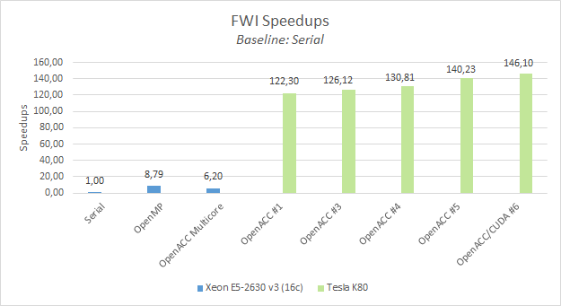
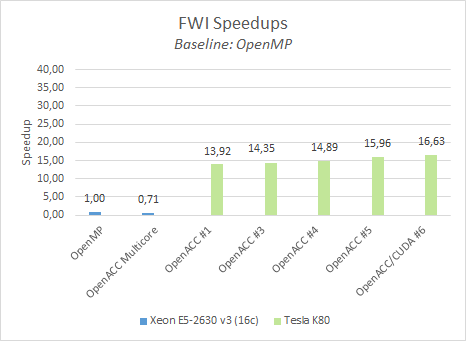

# GTC2018 - Instructor-Led Lab: *Best GPU Code Practices Combining OpenACC, CUDA, and OmpSs*

> This lab is shold to be executed inside nvidia-docker with hopobcn/gtc2018-fwi:us image

## Lab Instructions

In this lab you will make modifications to a real world oil&gas mini application called `FWI`.
You will compile and execute the newly enhanced code in each step.
Along the way, solutions are provided, so you can check your work, or take a peek if you get lost.

After login into the machine you should see a folder called `FWI` containing each *step* and *solution* as a different branch:

```bash
~# git branch
* gtc2018-step1
  gtc2018-step1-sol
  gtc2018-step3
  gtc2018-step3-sol
  gtc2018-step4
  gtc2018-step4-sol
  gtc2018-step5
  gtc2018-step5-sol
  ompss-openacc
```

Use `git diff <branch-name>` to compare branches and `git stash && git checkout <branch-name>` to discard non-commited changes and change to another step (branch).

###### Execution setup info (examples):

   Dual socket Intel(R) Xeon(R) E5-2630 v3 (Haswell) @ 2.40 GHz with 8 cores (16 core total, HT off)
   NVIDIA Tesla K80


> To save time, this step has been moved to Appendix 0

To compare our GPU executions we will use serial & OpenMP executions:

* Sequential execution with 1 core:
```bash
Number of frequencies 1
Number of shots 1
Number of gradient iterations 1
Number of test iterations 1
Output directory path: results
FWI Program finished in 1059.629833 seconds
```
* OpenMP execution with 16 threads (1 per core)
```bash
Number of frequencies 1
Number of shots 1
Number of gradient iterations 1
Number of test iterations 1
Output directory path: results
FWI Program finished in 120.587904 seconds
```


## Step 1: Express parallelism with OpenACC directives

In the initial step, you have to express parallelism available around expensive loops in the application. 
We assume you already have some OpenACC knowledge.

#### [Detailed instructions](GTC2018-step1.md)

#### Simplified instructions:

0. `git checkout gtc2018-step1`
1. Add `#pragma acc kernels` pragmas to `compute_component_vcell_TL:166` and `compute_component_scell_TR:624` functions (from `src/fwi_propagator.c` file)
2. Compile `fwi`: 

    ```
    mkdir build && cd build
    cmake -DCMAKE_C_COMPILER=pgcc -DUSE_OPENACC=ON ..
    ```
    
3. Inspect the compiler output. Try to identify if the kernels were successfully generated or if you found messages like: `Loop carried dependence due to exposed use of [array-name] prevents parallelization`.
3. Fix the previous issue providing `#pragma acc loop independent` to each loop-nest
4. Compile and run `fwi`:

    `$ make irun`

## Step 2: Profile the application

Step 2 will profile the application to find possible weaknesses and optimization opportunities. 
We could use *NVIDIA Visual Profiler* for a graphical assestment or `pgprof`/`nvprof` for a command-line visualization. 
For simplicity in this lab we are going to use `nvprof`

#### [Detailed instructions](GTC2018-step2.md)
#### Simplified instructions:

0. `git checkout gtc2018-step2`
1. Profile `fwi` with:

   `nvprof --dependency-analysis bin/fwi fwi_schedule.txt` 
   
    or 
    
   `NVVP`
   
2. Observe if:
   1. Which kernels take the most time in the critical path
   2. Is memory traffic due CUDA Unified Memory an issue?

## Step 3: Express data movement: from CUDA Unified memory to OpenACC data directives

Unified Memory (UM) can be very inefficient in older GPU generations and an experienced programmer with detailed knowledge of the application algorithm could outperform the Unified Memory.

As we have seen in Step 2, `FWI` doesn't specially suffer from too much UM traffic.
But as an example, in this step we'll migrate from UM to a movement of data using OpenACC directives.

#### [Detailed instructions](GTC2018-step3.md)
#### Simplified instructions:

0. `git checkout gtc2018-step3`
1. Annotate, using OpenACC directives, which arrays will be used on the GPU:
   In `alloc_memory_shot` function (`src/fwi_kernel.c`), *after* all allocations, complete the OpenACC section:
   
   ```c
   coeff_t cc = *c;
   #pragma acc enter data create(cc)
   #pragma acc enter data create(cc.c11[:cellsInVolume])
   #pragma acc enter data create(cc.c12[:cellsInVolume])
   #pragma acc enter data create(/* COMPLETEME */)
   #pragma acc enter data create(/* COMPLETEME */)
   ... // continue with c13,c14,c15,c16, c22,c23,c24,c25,c26, c33,c34,c35,c36, c44,c45,c46, c55,c56, c66
   ```
   In `free_memory_shot` function, *before* all dealocations (`free`) we should first, deallocate the GPU memory with:
   
   ```c
   #pragma acc wait
   
   #pragma acc exit data delete(c->c11)
   #pragma acc exit data delete(c->c12)
   #pragma acc exit data delete(/* COMPLETEME */)
   #pragma acc exit data delete(/* COMPLETEME */)
   ...
   #pragma acc exit data delete(c)
   ...
   
2. In `compute_component_vcell_TL:166` and `compute_component_scell_TR:625` functions.
   Specify that all the GPU arrays are already on the gpu with the `present` clause

3. Compile and run `fwi`:
                        
   `$ make irun`

## Step 4: Optimize kernel scheduling with multiple streams

OpenACC follows the same semantics as CUDA regarding streams.
By default, kernels and memory copies are executed in the default stream which imposes serialization between kernels and memory transfers.

Since we know that *scell* don't have dependences between each other (same for *vcell* functions) we could launch all the *scell*/*vcell* kernels to different streams.

#### [Detailed instructions](GTC2018-step4.md)
#### Simplified instructions:

OpenACC uses the clause `async` that requires a nonnegative scalar integer as a parameter.
In `include/fwi/fwi_propagator.h::78` we have already prepared an enum that we are going to use as identifiers:
```c
typedef enum {TR, TL, BR, BL} phase_t;
```

0. `git checkout gtc2018-step4`
1. Add the `async` clause to all OpenACC kernels (`src/fwi_propagator.c`)

   All *scell* & *vcell* functions provide a parameter named `phase` which can be provided to the OpenACC clause: `async(phase)`
   
2. In `velocity_propagator` and `stress_propagator`
   
   Pass as the last paramter, the stream identifier from `phase_t` enum (`TR`,`TL`,`BR` or `BL`).
   
3. Compile and run `fwi`:
                        
   `$ make irun`

## Step 5:  Add glue code to call CUDA Kernels

`FWI` is a great candidate to take advantage of shuffle intrinsics and shared memory.
OpenACC provides the directive `cache` to exploit shared memory, but it lacks a way to exploit CUDA intra-warp intrinsics.

In this step we provide a set of highly optimized kernels in `src/fwi_propagator.cu` file.
Your task consists on adding the necessary glue code to get:
 - The GPU device pointers managed by the OpenACC runtime
 - The CUDA stream allocated by OpenACC
 
#### [Detailed instructions](GTC2018-step5.md)
#### Simplified instructions:

0. `git checkout gtc2018-step5`
1. Add `#pragma acc host_data use_device` directives to forward the *device pointers* allocated by OpenACC to our CUDA kernels
2. Pass the current stream to the CUDA kernel (with `acc_get_cuda_stream`)
3. Compile and run `fwi`:
                        
   `$ make irun`





## FWI OmpSs/OpenACC

[OmpSs/OpenACC - Detailed instructions](GTC2018-ompss-openacc.md)


# Appendix
## Characterize FWI application

[Detailed instructions](GTC2018-step0.md)