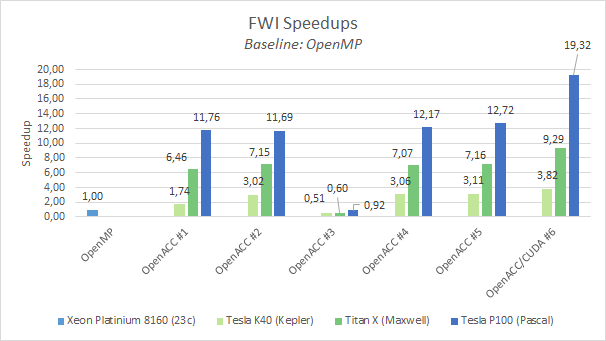

# GTC2018 - Instructor-Led Lab: *Best GPU Code Practices Combining OpenACC, CUDA, and OmpSs*

> This lab is shold to be executed inside nvidia-docker with hopobcn/gtc2018-fwi:eu image

## Lab Instructions

In this lab you will make modifications to a real world oil&gas mini application called `FWI`.
You will compile and execute the newly enhanced code in each step.
Along the way, solutions are provided, so you can check your work, or take a peek if you get lost.

After login into the machine you should see a folder called `FWI` containing each *step* and *solution* as a different branch:

TODO: branches
```bash
~# git branch
* gtc2018
  gtc2018-step1-sol
  gtc2018-step2
  gtc2018-step2-sol
  gtc2018-step3
  gtc2018-step3-sol
  gtc2018-step4
  gtc2018-step4-sol
  gtc2018-step5
  gtc2018-step5-sol
  gtc2018-step6
  gtc2018-step6-sol
  ompss-openacc
```

Use `git diff <branch-name>` to compare branches and `git stash && git checkout <branch-name>` to discard non-commited changes and change to another step (branch).

###### Execution setup info (examples):

   Dual socket Intel(R) Xeon(R) E5-2630 v3 (Haswell) @ 2.40 GHz with 8 cores (16 core total, HT off)
   NVIDIA Tesla K80

## Step 0: Characterize FWI and identify Available Parallelism

> To save time, this step has been moved to Appendix 0

To compare our GPU executions we will use serial & OpenMP executions:

* Sequential execution with 1 core:
```bash
Number of frequencies 1
Number of shots 1
Number of gradient iterations 1
Number of test iterations 1
Output directory path: results
FWI Program finished in 1059.629833 seconds
```
* OpenMP execution with 16 threads (1 per core)
```bash
Number of frequencies 1
Number of shots 1
Number of gradient iterations 1
Number of test iterations 1
Output directory path: results
FWI Program finished in 120.587904 seconds
```


## Step 1: Express parallelism with OpenACC directives

In this step, you will add compute regions around expensive loops in the application. 
We assume you already have some OpenACC knowledge.

In this lab we have used the **kernels** directive extensively but the **loop** directive could also been used.

To reduce time, we will suppose we have profiled the mini-app and we got this results (see Appendix 0):

```bash
Number of frequencies 1
Number of shots 1
Number of gradient iterations 1
Number of test iterations 1
Output directory path: results
FWI Program finished in 1059.575686 seconds

======== CPU profiling result (bottom up):
Time(%)      Time  Name
 19.99%  211.766s  IDX
 16.53%  175.115s  compute_component_scell_TR
 16.28%  172.505s  compute_component_scell_BL
 15.63%  165.634s  compute_component_scell_BR
  9.47%  100.343s  compute_component_scell_TL
  5.87%  62.2217s  compute_component_vcell_TR
  5.83%  61.7416s  compute_component_vcell_BR
  5.17%  54.7615s  compute_component_vcell_BL
  5.15%  54.5714s  compute_component_vcell_TL

======== Data collected at 100Hz frequency
======== Percentage threshold: 1%
```
We can see that `scell` and `vcell` functions dominate the execution time.
`IDX` is the function that linearizes the (i,j,k) triplet into the linear index.
Usually the compiler is smart enough to inline it, but in this execution it didn't.
Since we know that `IDX` is only called inside `scell` and `vcell` functions, we can safely split the `IDX` execution time among `scell` and `vcell` functions.
Therefore we can safely say that `scell` and `vcell` accounts for the 99% of the execution time of the application.

If we take a look at those functions in **src/fwi_propagator.c** we will arrive to this conclusions:
1. They are embarrassingly parallel
2. All `TR`/`TR`/`BL`/`BR` are very similar
3. We have to apply the same parallelization strategy for all *scell* and *vcell* functions.


In this first implementation we are going to use CUDA Unified Memory.
For that purpose we already modified **CMakeLists.txt** to add the `managed` to the `-ta=tesla` openacc target:
```cmake
set(OpenACC_C_FLAGS "${OpenACC_C_FLAGS} -ta=tesla,cuda8.0,cc20,cc35,cc50,cc60,lineinfo,managed")
```


> To facilitate your work we already implemented the majority of `openacc` pragmas leaving `vcell_TL` and `scell_TR` for you to implement.

*TODO*: add a simple `#pragma acc kernels` in the outer-most loop of `src/fwi_propagator.c:166` (`compute_component_vcell_TL`) and `src/fwi_propagator.c:634` (`compute_component_scell_TR`). Example for `vcell_TL`:
```c
#pragma acc kernels
for(integer y=ny0; y < nyf; y++)
{
    for(integer x=nx0; x < nxf; x++)
    {
        for(integer z=nz0; z < nzf; z++)
        {
            const real lrho = rho_TL(rho, z, x, y, dimmz, dimmx);

            const real stx  = stencil_X( _SX, sxptr, dxi, z, x, y, dimmz, dimmx);
            const real sty  = stencil_Y( _SY, syptr, dyi, z, x, y, dimmz, dimmx);
            const real stz  = stencil_Z( _SZ, szptr, dzi, z, x, y, dimmz, dimmx);

            vptr[IDX(z,x,y,dimmz,dimmx)] += (stx  + sty  + stz) * dt * lrho;
        }
    }
}
```

Then compile `fwi` (*make sure  to use* **pgcc** *compiler* and to *enable OpenACC* with **-DUSE_OPENACC=ON** !), and observe the compiler output:

```bash
$ mkdir build
$ cd build
$ cmake -DCMAKE_C_COMPILER=pgcc -DUSE_OPENMP=OFF -DUSE_OPENACC=ON ..
$ make
...
[ 11%] Building C object src/CMakeFiles/fwi-core.dir/fwi_propagator.c.o
...
compute_component_vcell_TL:
    166, Generating implicit copy(vptr[:])
    170, Loop carried dependence due to exposed use of vptr[:*] prevents parallelization
         Accelerator scalar kernel generated
         Accelerator kernel generated
         Generating Tesla code
        170, #pragma acc loop seq
        174, #pragma acc loop seq
        180, #pragma acc loop seq
    174, Loop carried dependence due to exposed use of vptr[:*] prevents parallelization
         180, Complex loop carried dependence of vptr-> prevents parallelization
              Loop carried dependence due to exposed use of vptr[:*] prevents parallelization
...
compute_component_scell_TR:
    636, Loop carried dependence due to exposed use of sxzptr[:*],szzptr[:*],syzptr[:*],syyptr[:*],sxyptr[:*],sxxptr[:*] prevents parallelization
         Accelerator scalar kernel generated
         Accelerator kernel generated
         Generating Tesla code
        636, #pragma acc loop seq
        640, #pragma acc loop seq
        646, #pragma acc loop seq
    640, Loop carried dependence due to exposed use of sxzptr[:*],syzptr[:*],szzptr[:*],syyptr[:*],sxyptr[:*],sxxptr[:*] prevents parallelization
         646, Complex loop carried dependence of sxxptr->,syyptr-> prevents parallelization
              Loop carried dependence due to exposed use of sxzptr[:*] prevents parallelization
              Complex loop carried dependence of szzptr-> prevents parallelization
              Loop carried dependence due to exposed use of szzptr[:*],syzptr[:*] prevents parallelization
              Complex loop carried dependence of syzptr-> prevents parallelization
              Loop carried dependence due to exposed use of syyptr[:*] prevents parallelization
              Complex loop carried dependence of sxzptr-> prevents parallelization
              Loop carried dependence due to exposed use of sxyptr[:*] prevents parallelization
              Complex loop carried dependence of sxyptr-> prevents parallelization
              Loop carried dependence due to exposed use of sxxptr[:*] prevents parallelization
...
```

Oops! the compiler detects a dependence and prevents a parallelization (it generates a scalar kernel!). 
Since we know that *vcell_TL* is embarrasingly parallel and there isn't a dependence we have to force the compiler to ignore those dependences and parallelize it.
For that we have to add `#pragma acc loop independent` before each iteration level:
```c
#pragma acc kernels
#pragma acc loop independent
for (integer y=ny0; y < nyf; y++) {
    #pragma acc loop independent
    for (integer x=nx0; x < nxf; x++) {
        #pragma acc loop independent
        for (integer z=nz0; z < nzf; z++) {
```

Then we can compile the application again:
```bash
$ make
Scanning dependencies of target fwi-core
[ 11%] Building C object src/CMakeFiles/fwi-core.dir/fwi_propagator.c.o
...
compute_component_vcell_TL:
    166, Generating implicit copy(vptr[:])
    171, Loop is parallelizable
         Generating Multicore code
        171, #pragma acc loop gang
    176, Loop is parallelizable
         183, Loop is parallelizable
              Accelerator kernel generated
              Generating Tesla code
             171, #pragma acc loop gang /* blockIdx.y */
             176, #pragma acc loop gang, vector(4) /* blockIdx.z threadIdx.y */
             183, #pragma acc loop gang, vector(32) /* blockIdx.x threadIdx.x */
...
compute_component_scell_TR:
    640, Loop is parallelizable
         Generating Multicore code
        640, #pragma acc loop gang
    645, Loop is parallelizable
         652, Loop is parallelizable
              Accelerator kernel generated
              Generating Tesla code
             640, #pragma acc loop gang /* blockIdx.y */
             645, #pragma acc loop gang, vector(4) /* blockIdx.z threadIdx.y */
             652, #pragma acc loop gang, vector(32) /* blockIdx.x threadIdx.x */
...
[  9%] Linking C static library ../lib/libfwi-core.a
[ 33%] Built target fwi-core
[ 38%] Linking C executable ../../bin/fwi-data-generator
[ 42%] Built target fwi-data-generator
[ 47%] Linking C executable ../../bin/fwi-sched-generator
[ 52%] Built target fwi-sched-generator
[ 57%] Linking C executable ../bin/fwi
[ 61%] Built target fwi
[ 76%] Built target Unity
[ 80%] Linking C executable ../bin/fwi-tests
[100%] Built target fwi-tests
```

> Obs: Functions called from a parallel region (`== CUDA kernel`) should be declared a device function. For that OpenACC provides the `#pragma acc routine <type>` directive.
To speed-up the hands-on lab we already provide the code with those pragmas.
We encourage you to check `include/fwi/fwi_propagator.h` to see how it's done.

We also parallelized other less important parts of this application for you like the function `set_array_to_constant` (file `src/fwi_kernels.c`):

```c
void set_array_to_constant(...)
{
    #pragma acc kernels
    for ( integer i = 0; i < length; i++ )
        array[i] = value
}
```

In the time propagation loop (`propagate_shot` function of `src/fwi_kernel.c` file), we also added synchronizations after MPI exchange boundaries and before time compuations to prevent incorrect results.

#### Benchmark

After implementing all *scell* and *vcell* functions we can proceed to measure the execution time:
```bash
$ make irun
[ 62%] Built target fwi-core
[ 87%] Built target fwi
Scanning dependencies of target irun
[100%] outputs will be in /home/ubuntu/FWI/scripts/output/
PROJECT_SOURCE_DIR: /home/ubuntu/FWI
PROJECT_BINARY_DIR: /home/ubuntu/FWI/build/bin
COMPILER_ID:        PGI
---
/home/ubuntu/FWI/build/bin/fwi fwi_schedule.txt
---
MPI rank 0 with GPU 0 (1)
Number of frequencies 1
Number of shots 1
Number of gradient iterations 1
Number of test iterations 1
Output directory path: results
FWI Program finished in 8.664497 seconds
[100%] Built target irun
```
That is, 13.9x faster than the OpenMP execution.

Remember you can see differences with the soluction with `git diff gtc2018-step1-sol`

## Step 2: Profile the applicaiton

Now discard all non-commited changes and checkout branch `gtc2018-step2`:

Step 2 will profile the application to find possible weaknesses and optimization opportunities. 
We could use *NVIDIA Visual Profiler* for a graphical assestment or `pgprof`/`nvprof` for a command-line visualization. 
For simplicity in this lab we are going to use `nvprof`:
```bash
$ nvprof --dependency-analysis bin/fwi fwi_schedule.txt
==1001== NVPROF is profiling process 1001, command: bin/fwi fwi_schedule.txt
MPI rank 0 with GPU 0 (1)
Number of frequencies 1
Number of shots 1
Number of gradient iterations 1
Number of test iterations 1
Output directory path: results
FWI Program finished in 11.814284 seconds
==1001== Profiling application: bin/fwi fwi_schedule.txt
==1001== Profiling result:
Time(%)      Time     Calls       Avg       Min       Max  Name
 21.65%  2.29883s       450  5.1085ms  456.05us  14.419ms  compute_component_scell_BR_905_gpu
 21.51%  2.28399s       450  5.0755ms  464.31us  14.305ms  compute_component_scell_TR_652_gpu
 20.80%  2.20928s       450  4.9095ms  445.40us  13.852ms  compute_component_scell_BL_1032_gpu
 12.65%  1.34301s       450  2.9845ms  278.01us  8.4036ms  compute_component_scell_TL_778_gpu
  6.10%  647.66ms      1350  479.75us  48.063us  1.3598ms  compute_component_vcell_BR_291_gpu
  5.76%  611.89ms      1350  453.25us  44.063us  1.2821ms  compute_component_vcell_TR_237_gpu
  5.73%  609.01ms      1350  451.12us  44.383us  1.2803ms  compute_component_vcell_BL_345_gpu
  5.66%  601.58ms      1350  445.61us  43.871us  1.2580ms  compute_component_vcell_TL_183_gpu
  0.14%  14.908ms       116  128.52us  128.16us  129.66us  set_array_to_constant_52_gpu

==1001== Unified Memory profiling result:
Device "Tesla K80 (0)"
   Count  Avg Size  Min Size  Max Size  Total Size  Total Time  Name
       1  4.0000KB  4.0000KB  4.0000KB  4.000000KB  3.648000us  Host To Device
       1  4.0000KB  4.0000KB  4.0000KB  4.000000KB  3.552000us  Device To Host
Total CPU Page faults: 1

...

==1001== Dependency Analysis:
==1001== Analysis progress: 100%
Critical path(%)  Critical path  Waiting time  Name
          19.27%      2.298834s           0ns  compute_component_scell_BR_905_gpu
          19.15%      2.283991s           0ns  compute_component_scell_TR_652_gpu
          18.52%      2.209276s           0ns  compute_component_scell_BL_1032_gpu
          11.26%      1.343006s           0ns  compute_component_scell_TL_778_gpu
           5.43%   647.659179ms           0ns  compute_component_vcell_BR_291_gpu
           5.13%   611.886147ms           0ns  compute_component_vcell_TR_237_gpu
           5.10%   608.965553ms           0ns  compute_component_vcell_BL_345_gpu
           5.04%   601.579973ms           0ns  compute_component_vcell_TL_183_gpu
           3.57%   426.061228ms           0ns  cuMemAllocManaged
           2.94%   350.987427ms           0ns  <Other>
           2.14%   254.883255ms           0ns  cuDevicePrimaryCtxRelease
           1.85%   220.329541ms           0ns  cuDevicePrimaryCtxRetain
           0.20%    24.006481ms           0ns  cuMemFree_v2
           0.18%    21.969030ms    10.619674s  cuStreamSynchronize
           ...        ...               ...       ...
...
```
The Critical path is the set of functions which determine the maximum execution time of the application.
Therefore optimization of the critical path should be our first priority.

We can see that *scell* kernels take a good chunck of the critical path.


## Step 3: Express data movement: from CUDA Unified memory to OpenACC data directives

Unified Memory (UM) can be very inefficient in older GPU generations and an experienced programmer with detailed knowledge of the application algorithm could outperform the Unified Memory.

As we have seen in Step 2, `FWI` doesn't specially suffer from too much UM traffic.
But as an example, in this step we'll migrate from UM to a movement of data using OpenACC directives.

OpenACC offers two sets of directives to to move data from host to device depending on the `scope`:
* `#pragma acc data` clause can be used to delcare a `scope` where the data resides in the GPU.
* `#pragma enter data` / `#pragma exit data` for variables that don't have a clear scope (used in more than one file).

In our case, given that all allocations and deallocations happens in different scopes we are going to use `#pragma acc enter data create` and `#pragma acc exit data delete` to increase the locality in the GPU.


To stop using UM we have to remove the `managed` flag from the `OpenACC_C_FLAGS` in `CMakeLists.txt` (already done).

In this step we are going to use OpenACC Data regions to increase the locality of data in the GPU. 

In `alloc_memory_shot` function (`src/fwi_kernel.c`), *after* allocations (`malloc`), declare all missing arrays for `coeff_t` (we already filled `v_t` and `s_t` ones).
Example:

```c
const integer datalen = numberOfCells;

coeff_t cc = *c;
#pragma acc enter data create(cc)
#pragma acc enter data create(cc.c11[:datalen])
#pragma acc enter data create(cc.c12[:datalen])
... // continue c11,c12,c13,c14,c15,c16, c22,c23,c24,c25,c26, c33,c34,c35,c36, c44,c45,c46, c55,c56, c66
```

In `free_memory_shot` function, *before* all dealocations (`free`) we should first, deallocate the GPU memory with:

```c
#pragma acc wait

#pragma acc exit data delete(c->c11)
#pragma acc exit data delete(c->c12)
...
#pragma acc exit data delete(c)
...
```

Then you have to tell to OpenACC that all arrays are already present on the GPU.
You can do that with the `present` clause:

For instace in *vcell_TL*:
```c
#pragma acc kernels present(szptr, sxptr, syptr, rho, vptr)
```

And for *scell_TR* kernels:
```c
#pragma acc kernels present(sxxptr, syyptr, szzptr, syzptr, sxzptr, sxyptr) \
                    present(vxu, vxv, vxw)  \
                    present(vyu, vyv, vyw)  \
                    present(vzu, vzv, vzw)  \
                    present(cc11, cc12, cc13, cc14, cc15, cc16) \
                    present(cc22, cc23, cc24, cc25, cc26) \
                    present(cc33, cc34, cc35, cc36) \
                    present(cc44, cc45, cc46) \
                    present(cc55, cc56) \
                    present(cc66)
```

#### Benchmarking

Now we can run the application again:
```bash
$ make irun
[100%] outputs will be in /home/ubuntu/FWI/scripts/output/
PROJECT_SOURCE_DIR: /home/ubuntu/FWI
PROJECT_BINARY_DIR: /home/ubuntu/FWI/build/bin
COMPILER_ID:        PGI
---
/home/ubuntu/FWI/build/bin/fwi fwi_schedule.txt
---
MPI rank 0 with GPU 0 (1)
Number of frequencies 1
Number of shots 1
Number of gradient iterations 1
Number of test iterations 1
Output directory path: results
FWI Program finished in 8.401898 seconds
[100%] Built target irun
```

We got a minor speedup of 1.02x. 


## Step 4: Optimize kernel scheduling using multiple threads

OpenACC follows the same semantics as CUDA regarding streams. 
By default, kernels and memory copies are executed in the default stream which imposes serialization between kernels and memory transfers.


FWI can be decomposed in multiples domains using MPI. 
The 3D structured grid is divided by the most non-contiguous dimension (`Y` in this case) and is distributed between several MPI processes.
At each timestep every MPI process must communicate their `HALO` regions to their neighbours.
This is implemented in the `exchange_halos` function present in `src/fwi_kernel.c` file.
One optimization when using GPUs is to overlap the communication phase of the *HALO* regions with the computation phase of the rest of the domain (excluding the HALOs).

For that purpose in this step you will employ multiple streams to perform H2D,D2H copies concurrently with kernel executions.

We are going to use `phase_t` enum present in `include/fwi/fwi_propagator.h::78` as stream identifiers:
```c
typedef enum {TR, TL, BR, BL} phase_t;
```

Then we can add the `async` clause to use multiple streams in *scell* and *vcell* functions.

For instance in `vcell_TL` (`src/fwi_propagator.c:168`):
```c
#pragma acc kernels ... async(phase)
```

#### Benchmarking

```
# make irun
[ 62%] Built target fwi-core
[ 87%] Built target fwi
[100%] outputs will be in /home/ubuntu/FWI/scripts/output/
PROJECT_SOURCE_DIR: /home/ubuntu/FWI
PROJECT_BINARY_DIR: /home/ubuntu/FWI/build/bin
COMPILER_ID:        PGI
---
/home/ubuntu/FWI/build/bin/fwi fwi_schedule.txt
---
MPI rank 0 with GPU 0 (1)
Number of frequencies 1
Number of shots 1
Number of gradient iterations 1
Number of test iterations 1
Output directory path: results
FWI Program finished in 8.100650 seconds
[100%] Built target irun
```
We got another 1.03x speedup.

## Step 5:  Add glue code to call CUDA Kernels

`FWI` is a great candidate to take advantage of shuffle intrinsics and shared memory.
OpenACC provides the directive `cache` to exploit shared memory, 

We provide a set of highly optimized kernels in `src/fwi_propagator.cu` file.
We also provide the necessary modifications in `CMakeLists.txt` for compiling with `nvcc` and linking with `pgcc`.
Just remember to pass `-DUSE_OPENACC=ON -DUSE_CUDA_KERNELS=ON` to cmake.


####In summary:
You'll add `#pragma acc host_data use_device` directives to forward the *device pointers* allocated by OpenACC to our CUDA kernels and call `acc_get_cuda_stream` to forward the current stream.
The parameters of `compute_component_vcell_TL_cuda` are the same of the current function without the phase, and with the stream we retrieved from the OpenACC runtime. Example:
```c
{
#if !defined(USE_CUDA)
    <... previous OpenACC impl. ...>
#else
    void* stream = acc_get_cuda_stream(phase)

    #pragma acc host_data use_device(szptr, sxptr, syptr, rho, vptr)
    {
        compute_component_vcell_TL_cuda(..., stream);
    }
#endif
};
```

In CUDA it is essential maximize memory bandwidth to achieve maximum performance. In our case we could take advantage of shared memory and shuffle instructions to boost the performance.

We already provide a set of highly optimized kernels (file `src/fwi_propagator.cu`).
Your job in this step consists on adding the necessary boilerplate code to use those kernels from OpenACC (in file `src/fwi_propagator.c`).

We also provide the necessary modifications in `CMakeLists.txt` for compiling with `nvcc` and linking with `pgcc`.
Just remember to pass `-DUSE_OPENACC=ON -DUSE_CUDA_KERNELS=ON` to cmake.

In summary. You will have to add `#pragma acc host_data use_device` directives to pass the *device pointers* allocated by OpenACC to our CUDA kernels and call `acc_get_cuda_stream` to forward the current stream to cuda in every **vcell**/**scell** function. The parameters of `compute_component_vcell_TL_cuda` are the same of the current function without the phase, and with the stream we retrieved from the OpenACC runtime. Example:
```c
{
#if !defined(USE_CUDA)
    <... previous OpenACC impl. ...>
#else
    void* stream = acc_get_cuda_stream(phase)

    #pragma acc host_data use_device(szptr, sxptr, syptr, rho, vptr)
    {
        compute_component_vcell_TL_cuda(..., stream);
    }
#endif
};
```

#### Benchmarking

Then recompile with USE_CUDA_KERNELS=ON and execute FWI:

```bash
$ cmake -DCMAKE_C_COMPILER=pgcc -DUSE_OPENMP=OFF -DUSE_OPENACC=ON -DUSE_CUDA_KERNELS=ON ..
$ make irun
[ 27%] Built target fwi-core-cuda
[ 72%] Built target fwi-core
[ 90%] Built target fwi
[100%] outputs will be in /home/ubuntu/FWI/scripts/output/
PROJECT_SOURCE_DIR: /home/ubuntu/FWI
PROJECT_BINARY_DIR: /home/ubuntu/FWI/build/bin
COMPILER_ID:        PGI
---
/home/ubuntu/FWI/build/bin/fwi fwi_profile.txt
---
MPI rank 0 with GPU 0 (1)
Number of frequencies 1
Number of shots 1
Number of gradient iterations 1
Number of test iterations 1
Output directory path: results
FWI Program finished in 7.566733 seconds
[100%] Built target irun
```
We got a 1.07 speedup




## FWI OmpSs/OpenACC

We include an experimental version of the new OmpSs/OpenACC interoperability.

The general idea is to use OmpSs to track the dependences between tasks and manage GPU memory & Streams while using OpenACC to generate GPU kernels without having to use CUDA.

The following example shows an `openacc` OmpSs task:
```bash
const integer size = dimmz * dimmx * dimmy;

#pragma omp target device(openacc) copy_deps
#pragma omp task in( [size]rho, [size]sxptr, [size]syptr, [size]szptr ) inout( [size]vptr ) label(vcell_TL)
#pragma acc kernels deviceptr(rho, sxptr, syptr, szptr, vptr)
#pragma acc loop independent
for(integer y=ny0; y < nyf; y++)
{
    #pragma acc loop independent
    for(integer x=nx0; x < nxf; x++)
    {
        #pragma acc loop independent
        for(integer z=nz0; z < nzf; z++)
        {
            const real lrho = RHO_BL( rho,z,x,y,dimmz,dimmx );

            const real stx = STENCILX( sxptr,SX,dxi,z,x,y,dimmz,dimmx );
            const real sty = STENCILY( syptr,SY,dyi,z,x,y,dimmz,dimmx );
            const real stz = STENCILZ( szptr,SZ,dzi,z,x,y,dimmz,dimmx );

            vptr[IDX(z,x,y,dimmz,dimmx)] += (stx  + sty  + stz) * dt * lrho;
        }
    }
}
```
We only support the `kernels` and `loop` directive with clauses `deviceptr`. 
Any other combination is not supported.
Also, we are restricted to only one GPU.

To build this example:
```bash
cd FWI-sol-ompss-acc
make -i
NX_ARGS="--gpus=1" ./fwi data/fwi_params.txt data/fwi_frequencies.profile.txt
```


# Appendix
## Step 0: Characterize FWI application

The initial step of every paralelization effort is to check whether it makes sense to apply optimizations or not.
In the case of accelerator programming a certain number of questions have to be answered before the first line of code is written.
This includes:
* Understanding the program structure and how data is passed through the call tree
* Profiling the CPU-only version of the application and identifying computationally-intense "hot spots"
* Identify which loop nests dominate the runtime
* Are the loop nests suitable for an accelerator?
* Insuring that the algorithms you are considering for acceleration are safely parallel


Firt. Compile & execute the sequential version of FWI:
```
$ mkdir build
$ cd build
$ cmake -DCMAKE_C_COMPILER=pgcc ..
$ make
```

Then you execute FWI either using `make irun` or `bin/fwi fwi_schedule.txt`. You should see something like this:
```
Number of frequencies 1
Number of shots 1
Number of gradient iterations 1
Number of test iterations 1
Output directory path: results
FWI Program finished in 1059.629833 seconds
```

Then we are going to profile FWI to search for hot spots using `make iprofile` which will call `nvprof --cpu-profiling on` (or call `nvprof` directly from console: `nvprof --cpu-profiling on bin/fwi fwi_schedule.txt`).

```bash
$ cmake -DCMAKE_C_COMPILER=pgcc ..
$ make
$ nvprof --cpu-profiling on --cpu-profiling-percentage-threshold 1 bin/fwi fwi_schedule.txt
Number of frequencies 1
Number of shots 1
Number of gradient iterations 1
Number of test iterations 1
Output directory path: results
FWI Program finished in 1059.575686 seconds

======== CPU profiling result (bottom up):
Time(%)      Time  Name
 19.99%  211.766s  IDX
 16.53%  175.115s  compute_component_scell_TR
 16.28%  172.505s  compute_component_scell_BL
 15.63%  165.634s  compute_component_scell_BR
  9.47%  100.343s  compute_component_scell_TL
  5.87%  62.2217s  compute_component_vcell_TR
  5.83%  61.7416s  compute_component_vcell_BR
  5.17%  54.7615s  compute_component_vcell_BL
  5.15%  54.5714s  compute_component_vcell_TL

======== Data collected at 100Hz frequency
======== Percentage threshold: 1%
```
We can see that `scell` and `vcell` functions dominate the execution time.
`IDX` is the function that linearizes the (i,j,k) triplet into the linear index.
Usually the compiler is smart enough to inline it, but in this execution it didn't.
Since we know that `IDX` is only called inside `scell` and `vcell` functions, we can safely split the `IDX` execution time among `scell` and `vcell` functions.
Therefore we can safely say that `scell` and `vcell` accounts for the 99% of the execution time of the application.

If we take a look at those functions in **src/fwi_propagator.c** we will arrive to this conclusions:
1. They are embarrassingly parallel
2. All `TR`/`TR`/`BL`/`BR` are very similar
3. We have to apply the same parallelization strategy for all *scell* and *vcell* functions.

Now we will recompile enabling OpenMP and execute the application to measure the performance of OpenMP vs the serial implementation:
```bash
Number of frequencies 1
Number of shots 1
Number of gradient iterations 1
Number of test iterations 1
Output directory path: results
FWI Program finished in 120.587904 seconds
```

