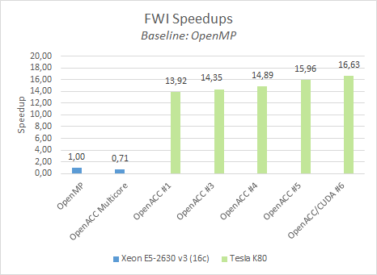

# GTC2018 - Instructor-Led Lab: *Best GPU Code Practices Combining OpenACC, CUDA, and OmpSs*

> This lab is shold to be executed inside nvidia-docker with hopobcn/gtc2018-fwi:eu image

## Lab Instructions

In this lab you will make modifications to a real world oil&gas mini application called `FWI`.
You will compile and execute the newly enhanced code in each step.
Along the way, solutions are provided, so you can check your work, or take a peek if you get lost.

After login into the machine you should see a folder called `FWI` containing each *step* and *solution* as a different branch:

```bash
~# git branch
* gtc2018-step1
  gtc2018-step1-sol
  gtc2018-step3
  gtc2018-step3-sol
  gtc2018-step4
  gtc2018-step4-sol
  gtc2018-step5
  gtc2018-step5-sol
  ompss-openacc
```

Use `git diff <branch-name>` to compare branches and `git stash && git checkout <branch-name>` to discard non-commited changes and change to another step (branch).

###### Execution setup info (examples):

   Dual socket Intel(R) Xeon(R) E5-2630 v3 (Haswell) @ 2.40 GHz with 8 cores (16 core total, HT off)
   NVIDIA Tesla K80

## Step 0: Characterize FWI and identify Available Parallelism

> To save time, this step has been moved to Appendix 0

To compare our GPU executions we will use serial & OpenMP executions:

* Sequential execution with 1 core:
```bash
Number of frequencies 1
Number of shots 1
Number of gradient iterations 1
Number of test iterations 1
Output directory path: results
FWI Program finished in 1059.629833 seconds
```
* OpenMP execution with 16 threads (1 per core)
```bash
Number of frequencies 1
Number of shots 1
Number of gradient iterations 1
Number of test iterations 1
Output directory path: results
FWI Program finished in 120.587904 seconds
```


## Step 1: Express parallelism with OpenACC directives

[STEP 1 - Detailed instructions](GTC2018-step1.md)

0. `git checkout gtc2018-step1`
1. Add `#pragma acc kernels` pragmas to `scell` and `vcell` functions
2. Compile `fwi`
3. Add `#pragma acc loop independent` to each loop-nest
4. Compile `fwi`
5. Run `fwi`
____
0. `git diff gtc2018-step1-sol`

## Step 2: Profile the applicaiton

[STEP 2 - Detailed instructions](GTC2018-step2.md)

0. `git checkout gtc2018-step2`
1. Profile `fwi` with `nvprof` or `NVVP`

## Step 3: Express data movement: from CUDA Unified memory to OpenACC data directives

[STEP 3 - Detailed instructions](GTC2018-step3.md)

0. `git checkout gtc2018-step3`
1. Annotate, using OpenACC directives, which arrays will be use on the GPU:
2. Compile `fwi`
3. Run `fwi`
____
0. `git diff gtc2018-step3-sol`

## Step 4: Optimize kernel scheduling using multiple threads

[STEP 4 - Detailed instructions](GTC2018-step4.md)

0. `git checkout gtc2018-step4`
1. Add the `async` clause to all OpenACC kernels
2. Compile `fwi`
3. Run `fwi`
____
0. `git diff gtc2018-step4-sol`

## Step 5:  Add glue code to call CUDA Kernels

[STEP 4 - Detailed instructions](GTC2018-step5.md)

0. `git checkout gtc2018-step5`
1. Add `#pragma acc host_data use_device` directives to forward the *device pointers* allocated by OpenACC to our CUDA kernels
2. Pass the current stream to the CUDA kernel (with `acc_get_cuda_stream`)
3. Compile `fwi`
3. Run `fwi`
____
0. `git diff gtc2018-step4-sol`





## FWI OmpSs/OpenACC

[STEP 4 - Detailed instructions](GTC2018-ompss-openacc.md)


# Appendix
## Step 0: Characterize FWI application

[STEP 0 - Detailed instructions](GTC2018-step0.md)